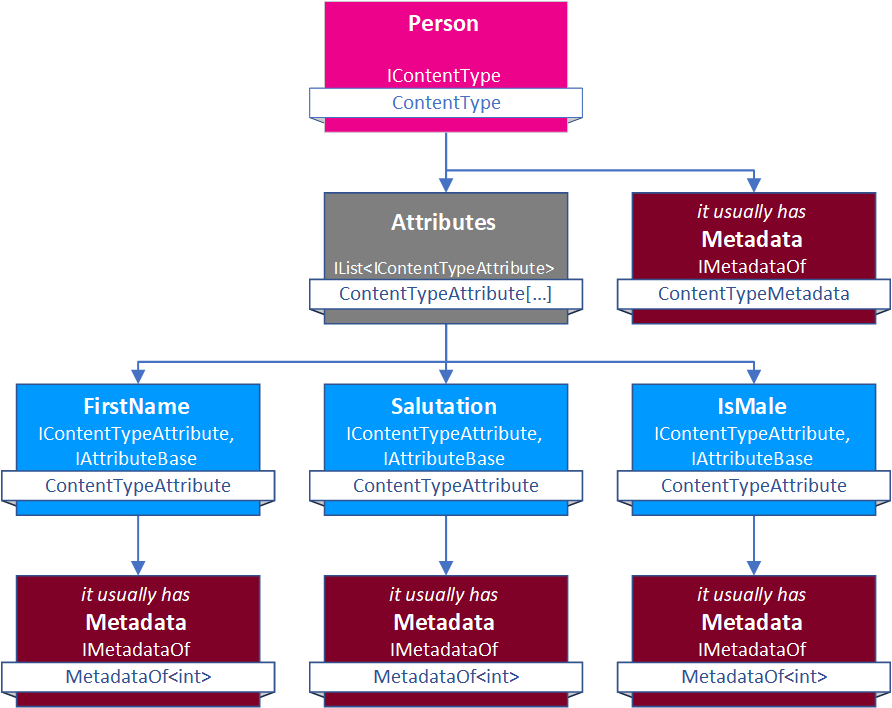

# Content-Type Object Structure

[!include["Data"](~/pages/basics/data/_shared-content-types.md)]

This section explains **Content-Type Object Structure**. For an overview check out .

---

> [!WARNING]
> What follows is very technical. For most use cases you don't need to know this stuff. 

Content-Types are internally structured as follows (in C# / .net):  
 
 

 

## Metadata of Content-Types and Attributes

Both the Content-Type and Attributes can have _Metadata_ providing more information about them. 

Since the Metadata for **Content-Types** and **Attributes** is stored as Entities, it's also multi-language

## History

1. Added in 2sxc 1.0

