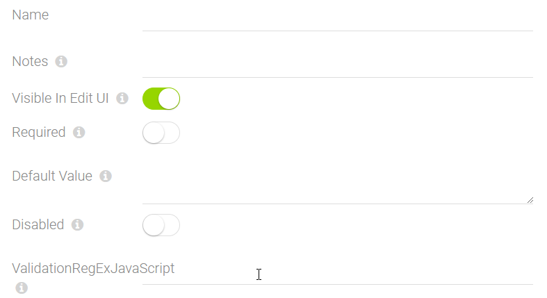

# General Field Settings

[!include["Data"](~/pages/basics/data/_shared-content-types.md)]

This explains **General Field Settings**. For an overview check out .

---

Every field has some general settings which apply to all fields. It's the information every field has to describe it's label, help-text etc. 

## Configuring the All field-type

Any field you open will contain the UI to configure the _All_ fields. This is what it looks like:

* `Name` is the is the label to be shown (multi-language)  
_Important: the name is not the name used in code, which shouldn't change - this is the visible label_
* `Default Value` what is prefilled when you create a new item
* **Notes / Description**
  * `Placeholder`
  * `Notes` a short help-text which will appear in field notes
* Edit UI Settings
  * `Visible` show this field in the UI
  * `Disabled` if it's disabled (grayed out)
  * `Required` if it's required
  * `DisableTranslate`
  * [`IsEphemeral`](xref:Basics.Data.Fields.Ephemeral) for temporary variables which won't be saved
* **Validation...** what rule it must match to allow saving

---
## Technical Information

This content type has a special name `@All`.
## History

1. Introduced in EAV 1.0 / 2sxc 1.0