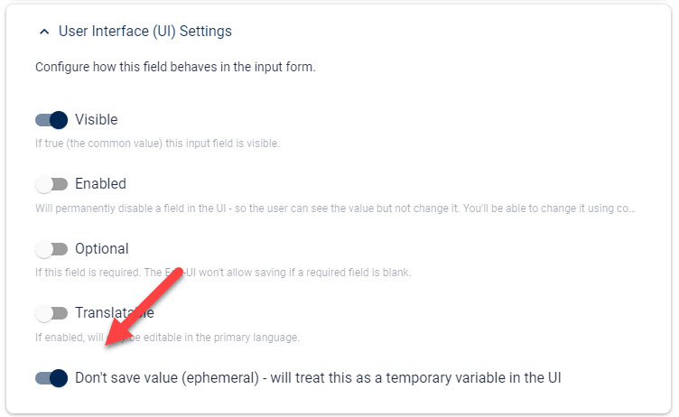

# Ephemeral / Temporary Fields for Variables

[!include["Data"](~/pages/basics/data/_shared-content-types.md)]

This explains **Ephemeral aka Temporary Variable Fields**. For an overview check out .

> [!NOTE]
> In v14 we added `data.parameters.*` to the [Formulas](xref:Basics.Edit.Formulas.Index).
> It contains all parameters given in the prefill.
>
> Since ephemeral fields are mainly used in [Formulas](xref:Basics.Edit.Formulas.Index),
> you may not need to ephemeral fields for your scenario.
>
> The main reason to still use ephemeral fields over `parameters` is when you do additional initialization logic
> which would be used in many Formulas in the form.

---

Sometimes you need fields which control the Form UI without being real data. Some examples:

1. Toggles which show/hide other fields or field groups
1. Hidden calculations which will consolidate other field values to determine if something else is required

We don't want to save these fields as the data is not relevant, and often the value should be calculated upon opening the form - so it's important that they are reset.

> These kinds of fields are _ephemeral_ = temporary

To configure a field to _not save_ and be temporary / ephemeral, use this setting:

> [!TIP]
> Since these fields are usually used as variables, we recommend that you name the `Var...`.
> Example: `VarShowAdvanced`.

## History

1. Introduced in 2sxc 12.01
1. Added `data.parameters` in v14

Shortlink to here: <https://go.2sxc.org/ephemeral>
