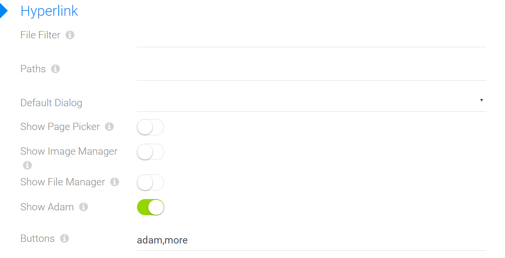

# Field Data Type: Hyperlink

[!include["Data"](~/pages/basics/data/_shared-content-types.md)]

This explains **Hyperlink Fields**. For an overview check out [](xref:Basics.Data.Index).

---

Hyperlink data is a basic [data type](xref:Basics.Data.Fields.Index) and is actually a string, but on reading it's automatically converts to an output-friendly format. It's used for normal links, page or file/image references as well as for complete sets of files (like image galleries). 

## Features 

The basic **hyperlink (links/files)** field is used for normal links, page or file/image references as well as for complete sets of files (like image galleries)

## Sub-Types of Hyperlink Fields

1. [hyperlink-default](xref:Basics.Data.Fields.Hyperlink-Default) - it's input field for normal links, page or file/image references. In menu it has ADAM (automatic digital asset manager), page picker, image manager and file manager.
1. [hyperlink-library](xref:Basics.Data.Fields.Hyperlink-Library) - it's for complete sets of files (like image galleries).

## Shared Settings

All Hyperlink-Field Types have the following settings:



* **File Filter** - list of extensions allowed in file/image picker. Example: *.jpg,*.bmp,*.png,*.gif
* **Paths** - this is only needed if you use the old file pickers (not ADAM). Root paths for the picker dialog - ideal if you want all images for this Content-Type to be in the same folder
  
  1. use the syntax foldername - without "/" in front to specify a subfolder of the site-root. Examples are "Apps" or "Gallery" or "Employees/Photos"
  2. you can also use subfolders - that would be "Employees/Photos"
  3. always remember that this folder must already exist, and Dnn must know that it is visible (readable) by the editing user. There are cases where the security settings were not set correctly in dnn - then the file picker won't show anything.

* **Default Dialog** - none, ADAM, page picker, image manager or file manager
* **Show Page Picker** - show page picker in the drop-down 
* **Show Image Manager** - show image manager in the drop-down 
* **Show File Manager** - show file manager in the drop-down 
* **Show Adam** - show the ADAM (automatic digital asset manager) in the drop-down menu.
* **Buttons** - will let you specify which buttons are visible directly. The default is "adam,more" but you could also do "adam,page,more" or just "page". File / image are currently not supported, because as of now, Dnn doesn't have a good image/file browser so we discourage its use. 


## Automatic Conversions of file and page references

The hyperlink data internally can contain values like:
1. `http://whatever/whatever` - will not be converted
1. `/some-relative-url` - will not be converted
1. `page:42` - will usually be converted to the real url of the page in Dnn
1. `page:42?something=value` - this will also be converted, but keeping the parameters
1. `page:42#something=value` - this will also be converted, but keeping the parameters
1. `file:2750` - will usually be converted to the real url of the file in Dnn
1. `file:2750?w=200` - this will also be converted, but keeping the parameters (like for thumbnails)
1. `file:2750#page=2` - this will also be converted, but keeping the parameters (like for pdf-page-links)

In 99% of all use cases, you want to generate html with a real link, which is why the content-objects in Razor will deliver an `http:...` instead of `file:27`. Some demo-code: 

```razor
  // assume that Content is a dynamic entity
  // assume that Image actually contains "file:274"
  

  // the result is now
  
```

## Accessing the Real Inner Value
In rare cases you may want the originl `page:22` instead of the converted value. To do this, use `AsEntity(yourObject)` and then use the EAV API on [](xref:ToSic.Eav.Data.IEntity) to read the underlying original value.

## Special: Hyperlink Libraries
A special use case is Libraries - where a hyperlink-field doesn't actually contain anything, but is a placeholder for ADAM assets. 
In such a scenario, you will use `AsAdam(...)` in your code to get the folders/files in the ADAM repository.

[!include["Note-Null"](./notes-null.md)]

> A common shorthand to work with this is either the `??` operator or using [RazorBlade](https://razor-blade.net/api/ToSic.Razor.Blade.Text.html) with `Text.Has(...)` or `Text.First(...)`.

---

## Technical Information

### Storage in the SQL Database in the EAV-Model
This is simply stored as a string in the DB, in the original format like `page:22`.

### Storage in the SQL Database in the JSON-Model
This is simply stored as a JSON string in the original format like `page:22`.


## Read also

* [](xref:Basics.Data.Fields.Hyperlink)
* [](xref:Tut.RazorBlade.Text.Has)
* [](xref:Tut.RazorBlade.Text.First)

## History

1. Introduced in EAV 1.0 / 2sxc 1.0
2. Changed in EAV 3.0 / 2sxc 6.0 (it used to have many configuration fields for all kinds of uses, which were then moved to sub-types)
