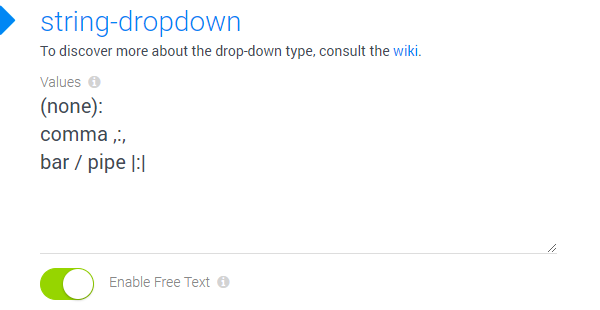

# Field Input-Type **number-dropdown**

Use this field type for configuring simple dropdown UI elements, storing [number data](xref:Basics.Data.Fields.Number). It's an extension of the [number field type](xref:Basics.Data.Fields.Number).

## Features 

1. provide values to select
1. provide visible labels which are different from the stored value
1. optionally allow users to type in something different
1. choose between value-label and label-value ordering
1. allow the use of `:` in values (just escape as `\:`)

## Special Behavior

1. When the drop-down UI element finds data stored, which doesn't match any of the values it has available, it will leave that data intact unless the users selects something manually

## Configuring a Number-Dropdown

This shows the configuration dialog:

## Using the Dropdown with the optional free-text-entry (2sxc 9.10)

This is what the UI looks like, if _Enable Free Text_ is enabled

If the user then clicks on the **I**-bar icon (**TT** in v11+), the input will change to text so you could type something different - like a _numeric_ value which wasn't suggested. 

---

## History

1. Introduced in EAV / 2sxc 12.04