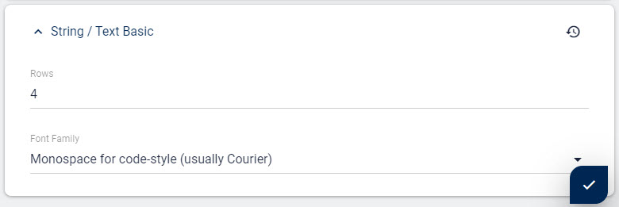

# Field Input-Type **string-default**

Use this field type for configuring simple text UI elements, storing [string/text data](xref:Basics.Data.Fields.String). It's an extension of the basic [string field type](xref:Basics.Data.Fields.String).

## Features 

1. provide a textbox
1. single-line or multi-line

## Configuring a String-Default

This shows the configuration dialog:

* **Row Count** is for setting the text-box height. Empty means default = 1
* **Font Family** is for setting the string field to use mono-space font (for code style input where each character has the same width) _new in 12.02_

---

## History

1. Introduced in EAV 1.0 2sxc 1.0, originally as part of the [string field type](xref:Basics.Data.Fields.String)
2. Changed in 2sxc 6.0 - Moved to it's own sub-type
3. Font-Family with monospace introduced in v12.02