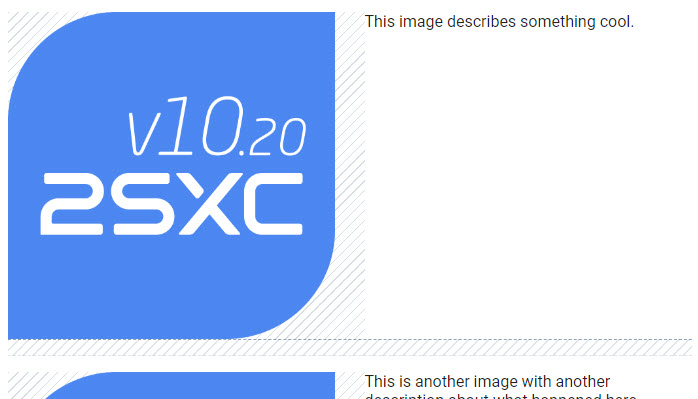
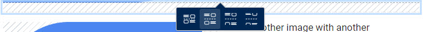
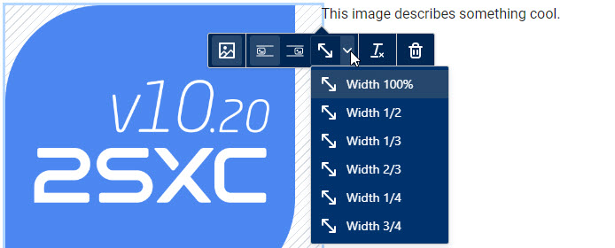
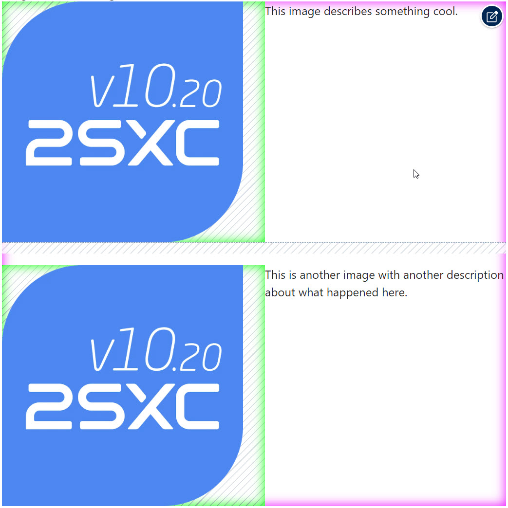

# Field Input-Type string-wysiwyg Rich-Mode _new 16.01_

A wysiwyg field which can be configured to be in various modes - see .
When this configuration is set, it will:

1. Provide buttons in the Edit UI to
    1. align images in a special way
    1. add splitters to reset content alignments after the splitter
    1. add spacers to create gaps of various sizes in content
    1. specify resizing using css-classes for the server-side image-resizing
1. Allow the razor [.Html(...)](xref:NetCode.DynamicData.DynamicEntityHtml) to
    1. automatically resize images
    1. make all images responsive using `<picture>` tags
    1. automatically add spacers

To make all this happen it needs this:

1. The new [mode setting](xref:Basics.Data.Fields.String-Wysiwyg)
1. The new behavior in the Edit UI
1. The new [.Html(...)](xref:NetCode.DynamicData.DynamicEntityHtml) API
1. Internal server-side code to find the images and replace them with responsive `<picture>` tags
1. Special CSS to make it all work (see below)
1. A special `debug` mode to help you in optimizing the CSS for your use case (see below)

## The Edit UI

If a string-wysiwyg is configured to behave in the new `rich` mode, the toolbars will look as follows:

The new buttons on the second row allow you to add spacers of various sizes.
When you add images or spacers which resulting in extra padding, the padding will be shown in the UI as follows:

When selecting a spacer, the context-toolbar will look as follows:

When selecting an image, the context-toolbar will look as follows:

This allows you to change the alignment (left/right) and to specify the size of the image.

> [!IMPORTANT]
> In the _classic_ wysiwyg-mode, the image-alignment was done using the `float` css-property
> and the width uses the `width` css-property.
>
> In this new **Rich** mode, it will only set CSS classes like `wysiwyg-left` or `wysiwyg-50`.
> So the final output will only change, if the CSS definition exists.
> This happens automatically, when you use the [.Html(...) method](xref:NetCode.DynamicData.DynamicEntityHtml).

## CSS

To make all of this work, we use a list of CSS classes which are applied in the edit-UI.
The output must of course also have these classes, so that the final result looks the same.
These are the classes that make it work:

* `wysiwyg-container` is set on the wrapper `
` so the classes inside will only apply to this field
* `wysiwyg-100`, `wysiwyg-50` etc. are width classes on the image
* `wysiwyg-left`, `wysiwyg-right` etc. are alignment classes on the image which also apply a padding to the opposite side
* `wysiwyg-splitter` are classes applied to `
` tags to reset image alignment and ensure the next content start below it
* `wysiwyg-spacer-0`, `wysiwyg-spacer-s` etc. are classes applied to `
` tags to create gaps of various sizes

The built-in CSS for this is automatically added to the page when you use the `.Html(...)` method.
It ensures correct sizing and will also re-order the images to be above the text on mobile.

It also ensures that multiple images on the same line will properly align and not stagger.
For example, 3 images each being 33% should have a padding after the first two, but not after the last one.

1. Image arrangements which work on all screens (eg. 4-in-a-row on desktop, but under-each-other on mobile)
1. Image text wrapping so that multiple side-images are under each other and not staggered

You can also add your own CSS to make it look different.

## Debug CSS

If you specify `debug: true` in the `.Html(..., debug: true)` method, it will add some CSS to the page to help you see what's going on.

This will show you:

1. the exact size/location/placement of the `wysiwyg-container` - shown in fading magenta
1. exact sizes of images - shown in bright fading green
1. paddings around images - shown as shaded areas
1. spacings / gaps of splitters - shown as shaded areas

---

## History

1. Introduced in v16.01 on Towel Day 2023

Shortlink: <https://go.2sxc.org/wysiwyg-rich>
