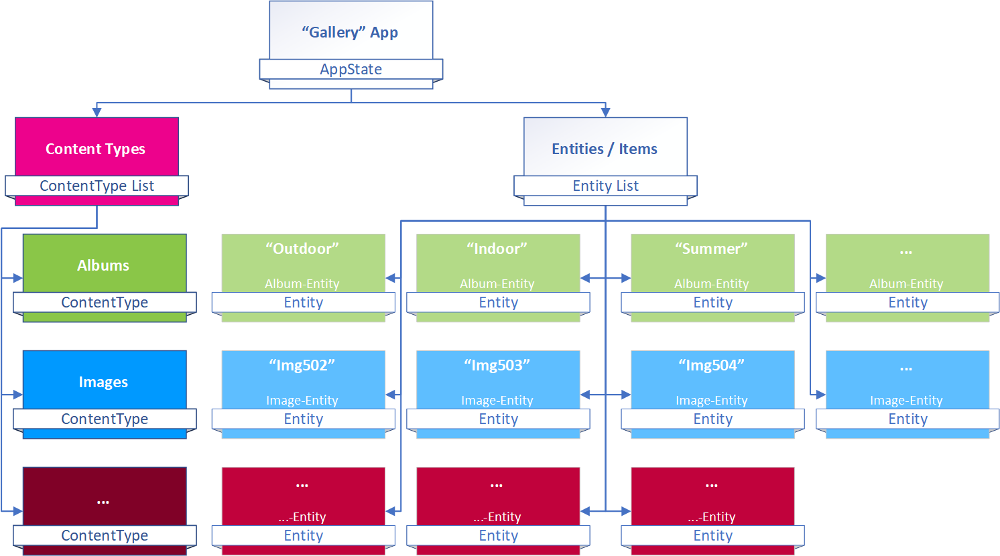

# Understanding Data...

[!include]

Data in 2sxc covers various aspects:

1. **Data** as a developers sees it - as tables of items / Entities
1. [Content](xref:Basics.Content.Index) as an editor sees it - basically bundles of text/image shown on a specific page
1. [Content Presentation Settings](xref:Basics.Content.Presentation) which configure how the content should be shown for each item
1. [Settings](xref:Basics.App.Settings) at App-Level
1. [Language Resources](xref:Basics.App.Resources) at App-level for multilanguage output
1. [Assets](xref:Basics.Content.Assets) (images, documents) belonging to this each data-item / Entity

This kind of data is usually used to:

1. Show in the browser with HTML
1. Show in the browser in a JS-application or SPA
1. Edit in the browser
1. Export / import data
1. Combine with other data
1. Use in other sites or mobile apps with a headless backend

This kind of data can be used in many ways. Let's start by looking where this fits in the stack:

[!include]
  

> [!TIP]
> The Edit UIs are automatically generated based on the Content-Type Schema which says what fields each kind of data has.

## App Data Model

Every App contains [Content-Types](xref:Basics.Data.ContentTypes.Index) and [Entities](xref:Basics.Data.Entities.Index) - like this:

 

* [Content Types](xref:Basics.Data.ContentTypes.Index) are the schema, they define what fields an entity has - peek the [object structure](xref:Basics.Data.ContentTypes.ObjectStructure).
* [Entities](xref:Basics.Data.Entities.Index) are the data-items, they contain the content - peek the [object structure](xref:Basics.Data.Entities.ObjectStructure).

Let's look at each piece in detail.

## Content-types

[!include["Data"](_shared-content-types.md)]

**Content-types** are the _Schema_. The are the rules which say that a `Person` has a `FirstName`, `Photo` and `Birthday` etc.
An App usually has a lot of Content-Types.

👉 
👉 

## Global / Shared Types

[!include["Data"](_shared-global-types.md)]

Usually a **Content-Type** is part of the App and only available inside that App. In rare cases you may have many sites (Portals) or many Apps which need the same **Content-Type**. In this case it's smarter to store this in a shared location.

👉 

 **Global-Types** are Content-Types which are stored in a system folder so they can be used in all Apps of an installation.

 👉 

## Entities / Content-Items

[!include["Data"](_shared-entities.md)]

**Entities** are **Dynamic Data Items**. They always belong to a **Content-Type** and have all the fields specified in that _Content-Type_. This makes them very dynamic.

* A `Person` has different fields than a `BlogPost`
* All the **Values** in an **Entity** can also be [multi-language](xref:Basics.Data.MultiLanguage.Index) by default

👉 

## Assets (Images / Documents)

[!include["Data"](_shared-assets.md)]

Assets come in 2 Flavors: _Private Assets_ and _Shared Assets_.

* **Private Assets**
    By default, assets uploaded in the UI belong to the **Entity** and to the **Field** they were added to. So the photo `daniel.jpg` belongs to the _Field_ `ProfilePhoto` of the _Entity_ `Person` #5020.
* **Shared Assets**
    _If_ the editor expects to re-use an asset elsewhere and _if_ the _Content-Type_ configuration allows this, then the asset can also be stored in a shared location.

👉 

## ADAM - the Automatic Digital Asset Manager

[!include["Data"](_shared-adam.md)]

**ADAM** is a subsystem of 2sxc. It's responsible for managing the files and storing them in a way that assigns _Private Assets_ to the _Entities_ and _Fields_ they belong to.

👉 

## External Data

[!include["Data"](_shared-external.md)]

External Data can come from anywhere. Here are some common scenarios:

1. `SQL` data coming from the Dnn database or from another DB
1. `CSV` data from a file which an editor updates from time to time
1. `SharePoint` document lists or tables
1. `JSON` data from another REST WebService

External Data is retrieved using one of the following methods:

1. a **[VisualQuery](xref:Basics.Query.VisualQuery.Index)** which was configured to get / filter / sort this data
1. C# code creating **[DataSource](xref:NetCode.DataSources.Index)** objects to retrieve this data
1. C# code using standard .net APIs to get / use this data

Once the data is retrieved it can be used in Templates, WebAPIs, JavaScript and SPAs.

## More Advanced Topics

1. [Entities and Dynamic Entities](xref:NetCode.Data.Index)
1. [Using Entities as Content or as Data](xref:Basics.Content.Index)
1. [Content Lists of Entities](xref:Basics.Content.Lists)
1. [VisualQuery](xref:Basics.Query.VisualQuery.Index)
1. [Data Sources](xref:NetCode.DataSources.Index)
1. [Headless APIs](xref:WebApi.Headless.Index)
1. [Metadata](xref:Basics.Metadata.Index)
