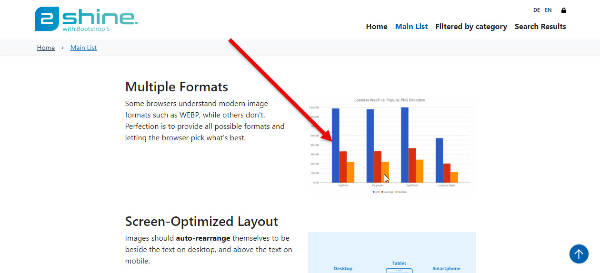
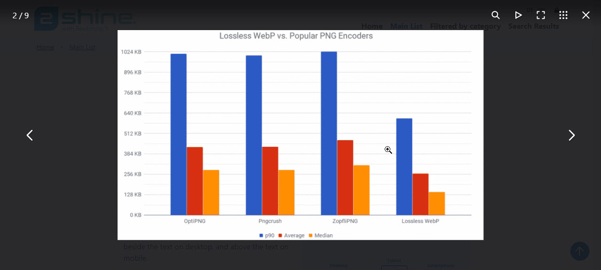
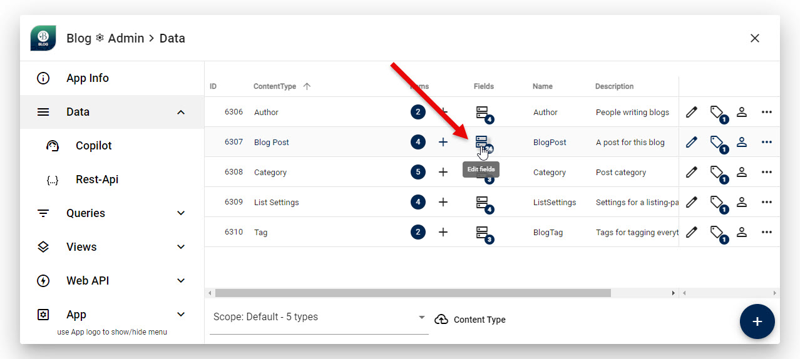
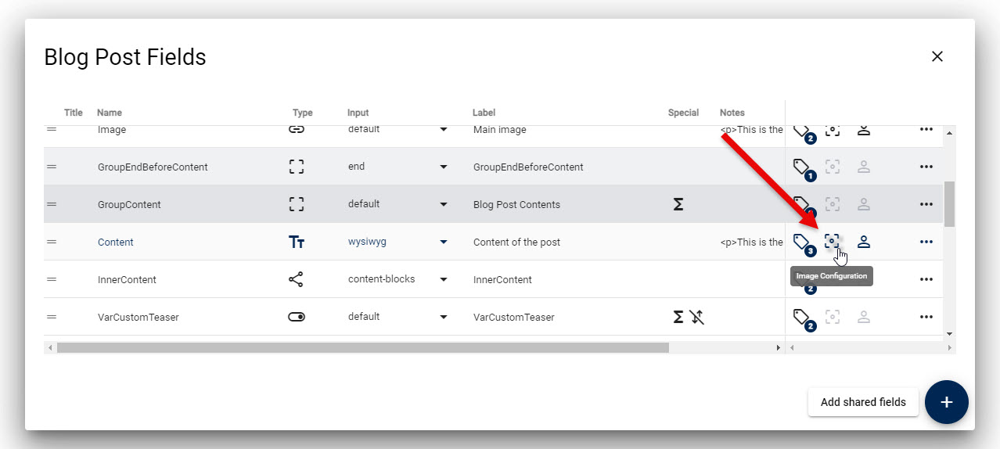
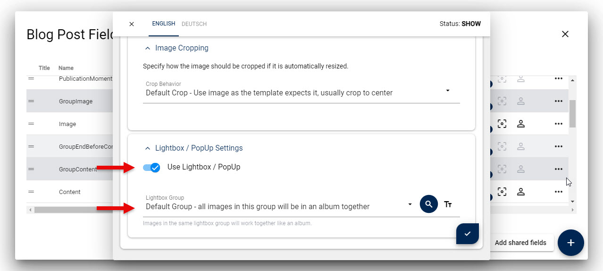
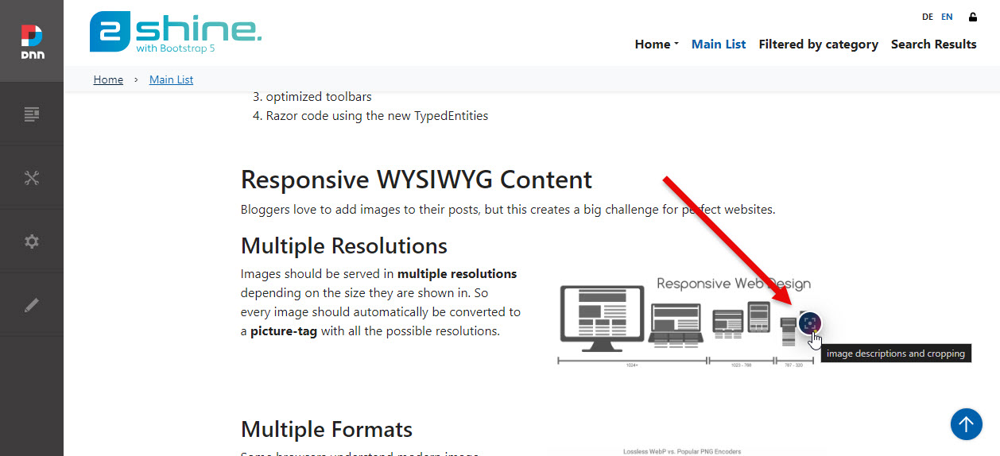

[!include[](~/assets/features/image-resizer.md)]

# Image Lightbox (new v17)

[!include[](~/pages/basics/stack/_shared-float-summary.md)]
<style>  .context-box-summary .image-resizer    { visibility: visible; } </style>

Images should often show a lightbox when clicked.
This is especially important for galleries, but also for single images.

2sxc 17 introduces the ability that images can be "lightboxed" according to editor input.

Previously only image where the Razor code explicitly set a lightbox would be shown this way.

> [!IMPORTANT]
> This feature requires the new Typed APIs (v17+) to be used,
> as the Razor code must generate the HTML to make this happen.
>
> This include the [Img(...)](xref:ToSic.Sxc.Data.ITypedItem.Img*),
> [Picture(...)](xref:ToSic.Sxc.Data.ITypedItem.Picture*)
> and [Html(...)](xref:ToSic.Sxc.Data.ITypedItem.Html*) APIs.

## Lightboxes for Images, Pictures and Media in HTML Contents

The automatic lightbox feature is available for images, pictures and images/pictures in HTML contents.

<div gallery="intro">
  
  
<div>

## Three Places to Enabled/Disable/Configure Lightboxes

Not every image should be lightboxed, so there are three places to control this:

1. In the code, the API which creates the image can be told to use (or not use) a lightbox <!-- note: 2dm, not really sure if there is a clear way to do this! -->
1. At the Field Configuration level (usually done by the admin) to set the default for this field.
1. On each specific image

### 1. Code Configuration (new v18.03)

When creating an image, the code can specify if the image should be lightboxed or not.

This feature is new in v18.03 as it requires the new tweak API.

```csharp
@something.Picture("GroupPic", tweak: t => t
  .LightboxEnable()
  .LightboxDescription("All participants")
  .Resize(t => t.Factor(0.5))
)
```

### 2. Field Configuration

When configuring the field, the admin can set the default for the field, which can be overridden by the editor when editing the content.
For example, the [Blog App](xref:App.Blog) has Lightboxes enabled on all posts in the latest version like this:

<div gallery="field-config">
  
  
  
<div>

This will configure the field so all images are lightboxed by default, and treated as a gallery together.

### 3. Configuration per Image

In most cases the field-configuration is all you need.
But the editor can choose to override this on a per-image basis.
For example, he/she could configure a lightbox where the field didn't auto-configure it,
could change the gallery-behavior and/or could disable the lightbox for a specific image.

<div gallery="config-per-img">
  
<div>


---

## History

1. Introduced ca. 2sxc 17
1. Better documented in 2sxc 18.03

Shortlink: <https://go.2sxc.org/image-lightbox>
