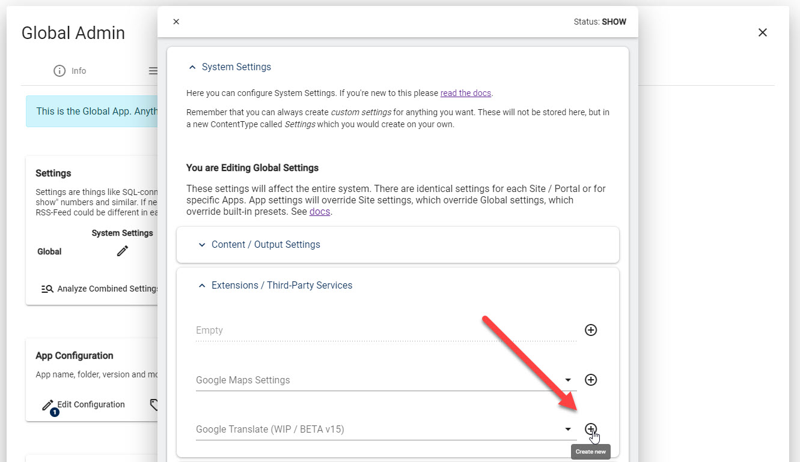
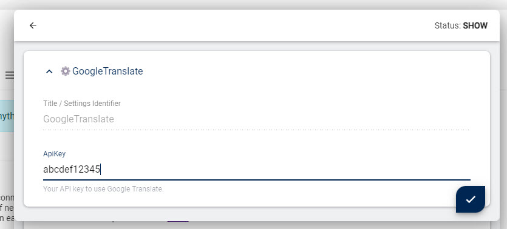

# 2sxc Auto-Translate - Google API Key

Auto-Translate uses [Google Translate](xref:Basics.Languages.AutoTranslate.Index),
and all Google services require an API Key to work.

Use of the Google Translate Service is free for up to 500'000 words a month,
so most users will be able to use a free key.

2sxc includes a built-in API key for demo purpose.
But because this is used on all sites which don't specify their own key,
it can easily happen that the limit is exceeded.

Because of this you will need to register your own API key.

## Register a Google Translate API Key

👉🏾 See [Googles Instructions](https://cloud.google.com/translate/docs/setup?hl=en)

## Activate the Google Translate API Key in the 2sxc/EAV Settings

The API Key is stored in the [Settings](xref:Basics.Configuration.Index).
Make sure you are familiar with them.
In the settings, this is where you would configure them:

You can place the key in 4 different locations:

1. A specific App (not recommended)
1. A specific Site
1. Global settings on all Sites of an installation (recommended)
1. In the presets (for scenarios where you pre-install the same API key in many installations, not documented ATM)

> [!NOTE]
> There is a small caching issue when creating the first ever global setting.
> ATM you'll need to restart DNN/Oqtane for it to be picked up.
>
> Once you have a global setting, you can change it without restarting DNN/Oqtane.

---

## History

1. Introduced in 2sxc v15

Shortlink: <https://go.2sxc.org/translate-api-key>
