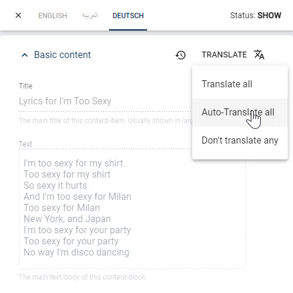
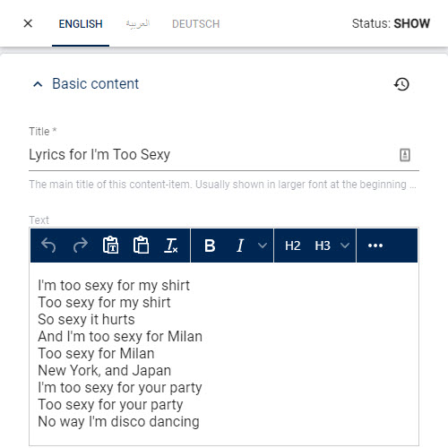
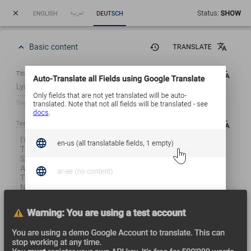
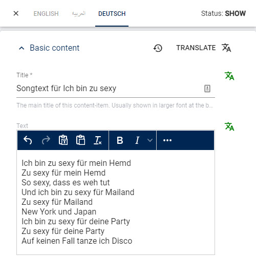
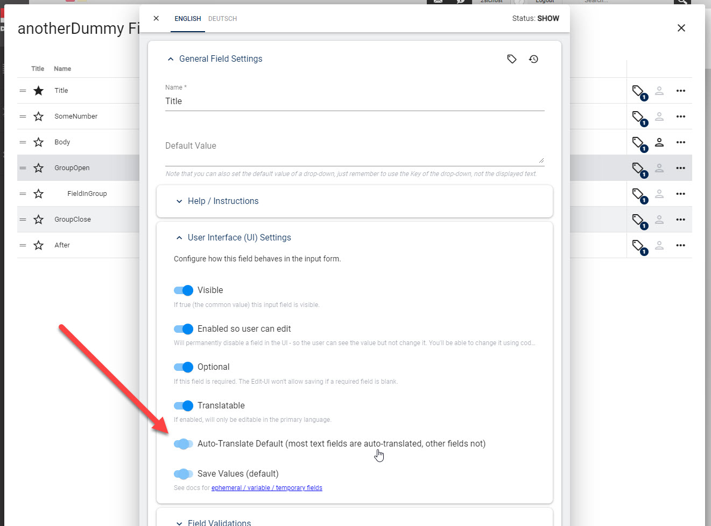

# 2sxc Auto-Translate Overview (new v15)

2sxc 15 adds a new feature to automatically translate content in the Edit UI.
Here's what you need to know.

## Patrons Only Feature

This is a patrons only feature.
To use this feature, need the license [**Patrons Advanced CMS**](xref:2sxc Auto-Translate Overview).
[See activation instructions](xref:Basics.LnF.Licenses.Index).

## Auto Translate uses Google Translate

Auto Translate uses the [Google Translate API](https://cloud.google.com/translate).
It is available in the Edit UI.
This way the editor can run auto-translate, optimize the results and save.
This requires a [Google API key](xref:Basics.Languages.AutoTranslate.ApiKey) for each site.

## Auto Translate User Experience

The user can choose to auto-translate a _single field_ or _all fields_.

  
  

After this, the user must select what source language should be used.
The UI will show you how many fields of the available source languages have content.

  
  

In the end you'll get the result for further editing.

  
  

## HTML and Unknown Content are Preserved

Google Translate will preserve anything it can't translate - such as names (if it can tell it's a name)
as well as HTML formatting.

## Not all Fields are Auto-Translated

Some fields are not auto-translated - either by default, or by configuration.

* Some fields will not be translated by default
  * Fields which can't be translated - such as entity-pickers
  * Fields which don't make sense to translate - eg. Numbers, Links, GPS coordinates
* Some fields are configured to not translate  
  _this can be configured at the field level_
  * Name fields should be configured to not translate
  * Address fields (street, city, etc.) should be configured to not translate
* Some fields were already translated manually, and will not auto-translate  
  _this is to prevent manual translations from being overwritten_

Fields which are not auto-translated will keep their previous status - in most cases locked (auto-inherit).

To configure a field to not auto-translate, you can do this here:

## FAQ

1. **Q: Is it possible to just auto-translate at runtime?**  
  A: Fully automatic translate at runtime is not useful so this is not what the feature does.

---

## History

1. Introduced in 2sxc 2 ca. 2012
1. Auto-Translate Content added in v15
