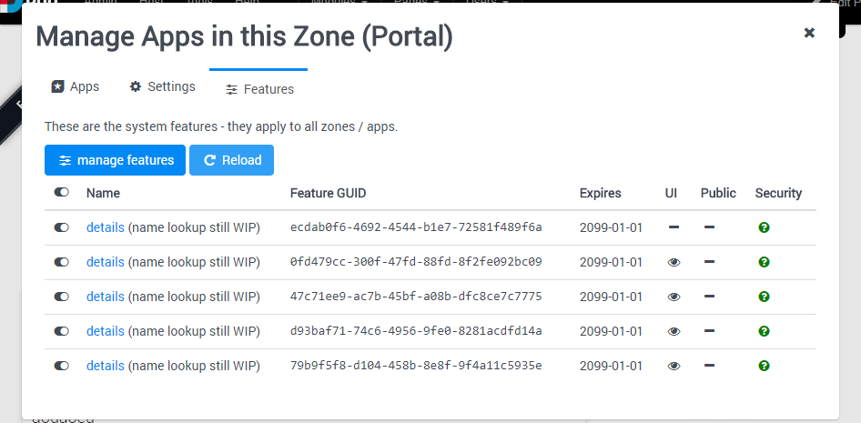

# Features Management

[!include]

A feature is a functionality of 2sxc or EAV, which can be enabled/disabled at system level.
Each feature is identified by a unique key, such as `PasteImageFromClipboard`.

👉🏾 [See the full list of licenses and features](https://patrons.2sxc.org/features)

## Behavior if Feature is Disabled

If a feature is not enabled and code needs to use the feature, it will either show an error OR simply skip that functionality.
This varies from feature to feature. If an error is thrown, the system will include a link to the missing feature as well as instructions to enable.

## Managing Features

This is done through the Apps-Management. This is what it looks like:

Read about managing features in the [blog about features-management](https://2sxc.org/en/blog/post/new-features-management-in-2sxc-9-30)

## How the Feature-Configurations are Stored

Features use a json-file called `features.json` located in the `[website-root]/desktopmodules/tosic_sexycontent/App_Data/system-custom/configurations` folder.

## Read also

* [Blog about new security mechanisms in 9.30](https://2sxc.org/en/blog/post/security-first-strategy-for-2sxc-9-30)

## History

1. Feature system introduced in v9.30
1. Improved to work with licenses in v13.01
1. New [IFeaturesService](xref:ToSic.Sxc.Services.IFeaturesService) in v13.01
