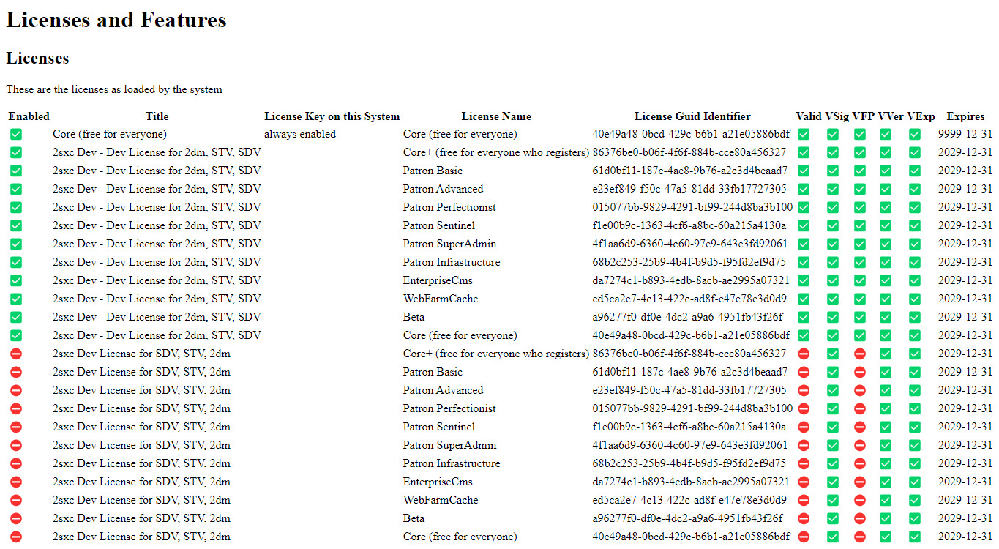

# Debug License Issues in 2sxc

If your license is producing unexpected results, you can use the following steps to debug the issue.

1. Go to 2sxc Insights
1. Make sure you're on Insights _home_
1. Click on _License_

Here you'll see a grid of all the licenses which are in the license file, as well as a status which checks succeeded or failed.

In the example above you can see:

1. The license for `Core` is auto-enabled
1. The licenses for various packages are enabled
1. Another license file was loaded, but the fingerprint checks failed, so they are not valid

---

## History

1. Licenses introduced iv v13.02
1. Enterprise Licenses introduced in v15
