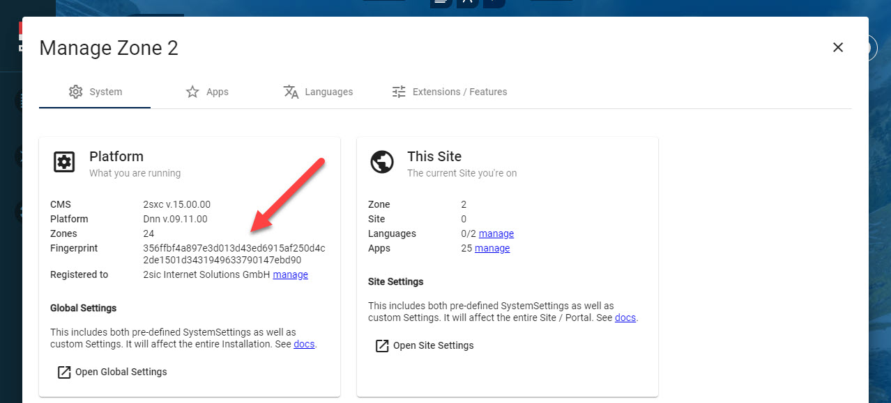
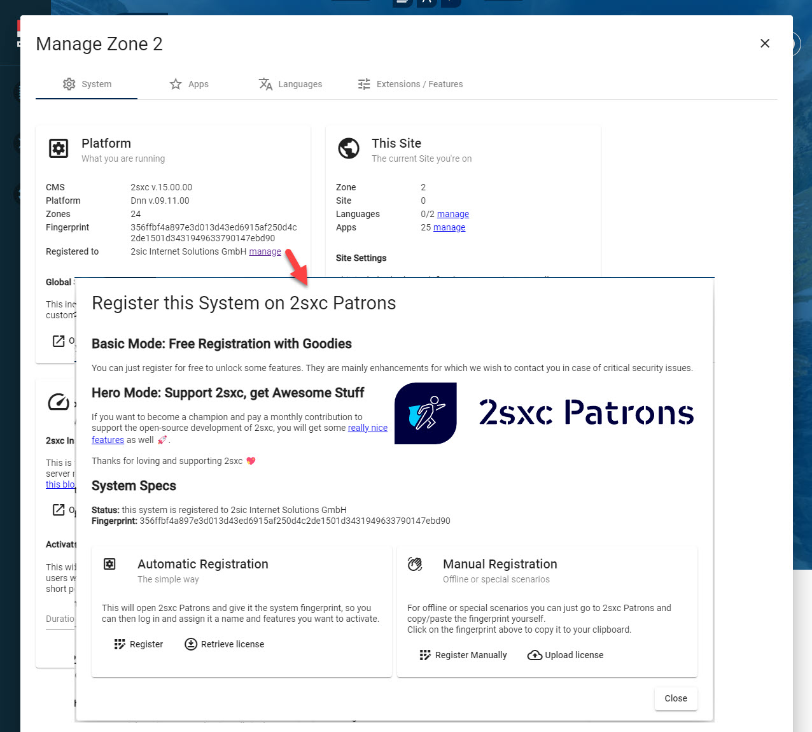
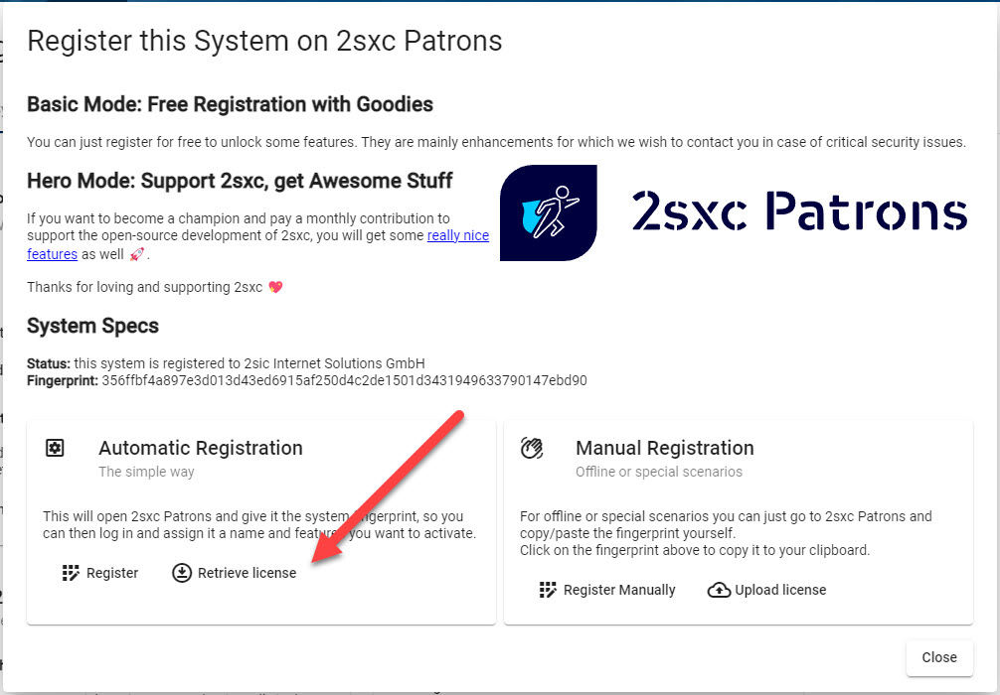
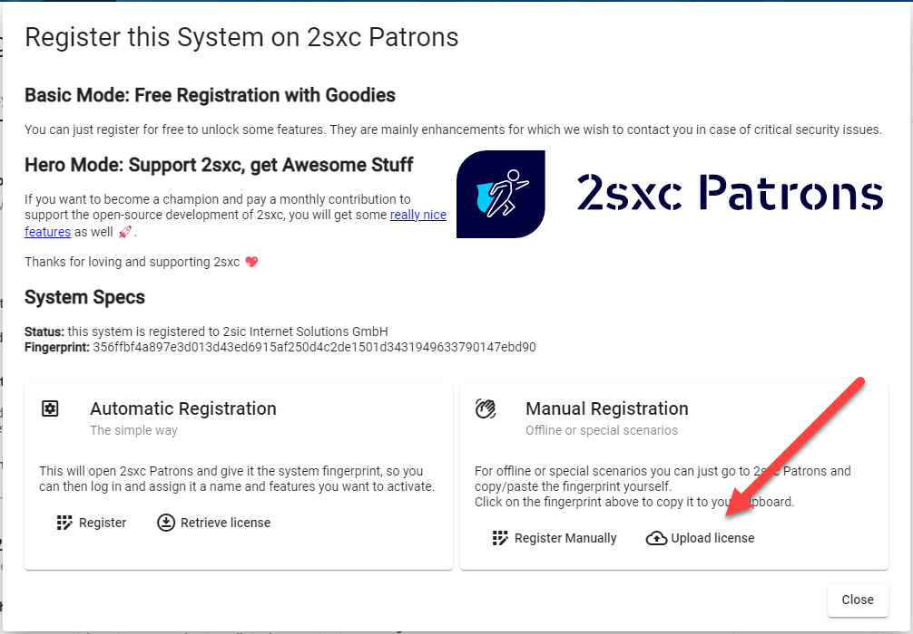

# Licenses in 2sxc

Licenses are special keys which will allow your system to use more advanced features.
Some of the additional features are **free** while others are only for supporters (Patrons) of 2sxc.

## System Fingerprint

To understand how the license ties to your installation, you should first know about the **fingerprint**.
Every system has a digital _fingerprint_ which consists of platform name (Dnn/Oqtane), platform version, 2sxc version and more.

* Every system has a generated fingerprint.
  It will stay the same until you do a major upgrade of the platform or 2sxc, or if you migrate the system.
* Enterprise scenarios with many installations can also add a custom fingerprint _in addition_ to the default fingerprint.
  This allows web companies to auto-enable certain licenses across all installations.
  Custom fingerprints are provided by the makers of 2sxc and stored as json files in the global `App_Data/system-custom`
  _new in v15_

## Registration

Every system which wishes to use advanced features (free or paid) must be registered on [2sxc Patrons](https://patrons.2sxc.org).

There are two types of users on **2sxc Patrons**:

1. If you have a GitHub Login you can use it to log on  
1. If you need an enterprise login or just don't have a GitHub login, you can log on using a normal DNN user in Patrons

Registration can be automatic or manual, depending on your needs.

* The automatic registration can be triggered from inside your 2sxc installation.
* Manual registration requires you to copy/paste your fingerprint from your 2sxc to Patrons.

## License Selection

Once a system is registered on 2sxc Patrons, you can select what licenses you want to enabled for that system.

1. If you don't support 2sxc you can activate free licenses
1. If you are a [Github-Sponsors patron](https://github.com/sponsors/2sic) then you can activate as many features as your contribution allows
1. If you are an Enterprise patron then you can activate the features based on the contract with the makers of 2sxc.

## Advanced Licenses for Patrons

To activate advanced licenses/features, you have two options:

1. Become a [GitHub Patron](https://github.com/sponsors/2sic) - this is only available for GitHub logins
1. [Reach out to makers of 2sxc](http://2sxc.org/contact) to get a custom license and an official bill.
  This works for both GitHub logins as well as enterprise logins.

You can now activate additional licenses based on your contribution and/or enterprise agreement.

## License Activation

The license file is a JSON file containing the activated licenses, the fingerprint and a digital signature.
This file must be transferred to your system to work.
The transfer can happen automatically or manually, depending on your needs.

Note that all licenses will be stored as `*.license.json` in this folder: `[website-root]/DesktopModules/ToSIC_SexyContent/App_Data/system-custom/configurations/`

### Automatic Activation

When you activate the license automatically you just have to click this button:

For this to work, the web server must be able to access the internet.
The license will be downloaded and stored in `[license-folder]/default.license.json`.

### Manual Activation

Manual activation is useful when the web server is not able to connect to the internet.
In that scenario, you can download the license file directly from Patrons and upload it using **Upload License** button.

Note that the manual license download has a different name than the default one.
This is by design, because 2sxc can use multiple licenses files.
Just remember that a future auto-download will not replace the manual file.

### Multiple Licenses

The licensing system allows multiple licenses to be activated.
This is useful in scenarios where you have an enterprise license on all systems to activate some features (maybe **Patron Infrastructure**)
and a system-specific license to add more features (like **Patron Sentinel**).

For this, all the licenses must be located in the license folder.

---

## History

1. Licenses introduced iv v13.02
1. UIs massively enhanced in v15
1. Ability to have 1-day trial licenses per feature added in 2sxc 15.02
