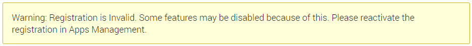
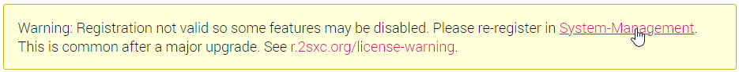

# Warning: Registration is Invalid

After a major upgrade you may see a message similar to this:



or this:



The message appears, because

1. The system has one or more license files
1. None of them are valid for the current system

As a result, any special features which are licensed / activated will be disabled.
The reason is that a license file was installed for a previous version of 2sxc, and must be upgraded to the new version.

## Background

2sxc uses licenses to activate special features.
These licenses are usually system-bound, meaning that they are activated for a specific system.
This is done by generating a fingerprint of the system, and then activating the license for that fingerprint.

Since 2sxc does not communicate with the license server, it cannot know if the license is valid for the current system.
So it uses a security hash which also contains the major version of 2sxc, requiring you to upgrade the license when you upgrade 2sxc.

📖 Read more about it in [](xref:Basics.LnF.Licenses.Index)

## How to Fix

Just [re-register your system using patrons](xref:Basics.LnF.Licenses.Index).

---

## Exact Warning Messages

These are included in case users google this exact message:

The text in v15 is:

```text
Warning: Registration is Invalid. Some features may be disabled because of this. Please reactivate the registration in Apps Management.
```

The text in v16 is:

```text
Warning: Registration not valid so some features may be disabled. Please re-register in System-Management.
This is common after a major upgrade. See r.2sxc.org/license-warning.
```


---

## History

1. Licenses introduced iv v13.02
1. Enterprise Licenses introduced in v15
1. Message updated in v16

Shortlink: <https://go.2sxc.org/license-warning>
