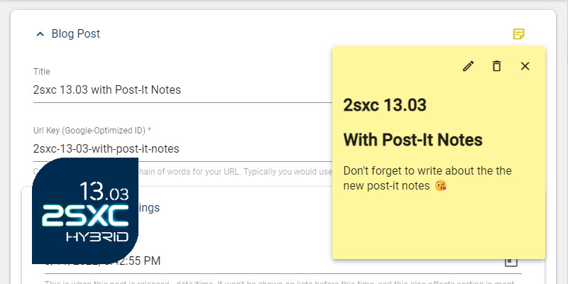

# Notes for Productivity

> [!TIP]
> The key concept behind **Notes**
> is being able to add notes and warnings anywhere you need them.

You can add notes to 2sxc in many places, to help you:

1. Document anything that's special
1. Add warnings to help you remember things
1. Mention pending tasks (still WIP)

## Notes in Entities

You can add notes to almost all entities (items) in the system, in the top right corner.
It looks like this:

Once added, editors will always see the yellow note-icon in the top right corner.

## Make a Note become a Warning

Notes can also be converted to warnings, in case it's really important.

## Future of Notes (WIP)

We have many plans for notes, incl.:

1. Ability to add to pages
1. Ability to show in the page if an item has a note
1. Ability to use notes as tasks, to collect things which must still be completed

## How Notes Work

Notes are simply [Metadata](xref:Basics.Metadata.Index) of the thing they describe.
They are stored as normal entities with a pointer to the thing they describe.

---

## History

1. Notes added in 2sxc 13.03 to use on entities
