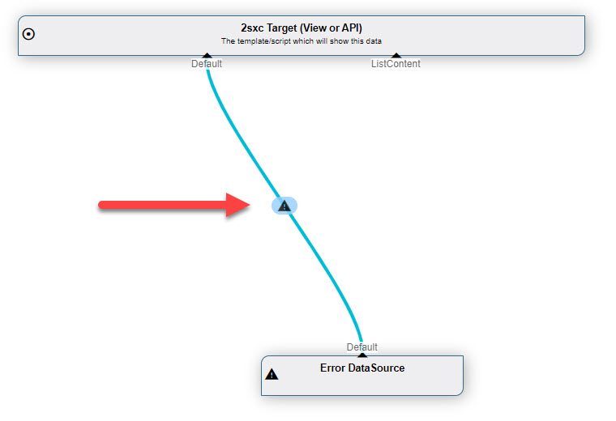

# VisualQuery 3: Debugging

[!include]

In 2sxc 11.13 we're introducing **VisualQuery 3** with two new feature to help you create VisualQueries

1. **Stream Debugging**
1. **Non-Breaking Errors**

## Stream Debugging

After running a query and closing the result-preview, you'll see how many items were on each stream. In **VisualQuery 3** you can now click on that stream to see exactly what was contained in the stream itself. 

Note that in the image you see

1. The title showing that you're looking at a stream
1. The items in that stream
1. An info that [VisualQuery](xref:Basics.Query.VisualQuery.Index) only picked the top 25 entries, but that you can re-run it with more results.

## Non-Breaking Errors

Previously if there was an error in a Query, the entire query would fail and you would get a error message which was very difficult to debug. 

Now the system is much simpler. If any Stream has an error it will actually still provide a single Entity containing the error information. This looks like this:

If you then click on the ⚠ you'll see the full message like this:

The button below will bring you to the [2sxc Insights](xref:NetCode.Debug.Insights.Index)...

...where you can click on a request and search for `Error` or `Exception` to find out more:

## Security Considerations

1. All the error information is also logged into Insights, so super-users can check that for more details.
1. If the query blows on a normal user, the data will not contain any important information - so no paths, no internal values, etc.
1. If the query blows on the Super-User we'll sometimes include more information - like the Path to the CSV file

## History

1. Introduced in [VisualQuery](xref:Basics.Query.VisualQuery.Index) 3, 2sxc 11.13

