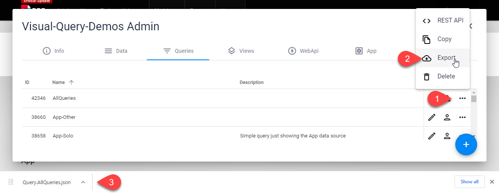
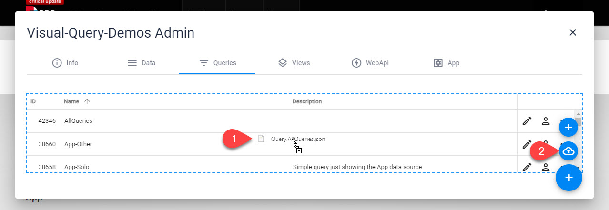

# Export / Import Queries

[!include]

Queries are can be exported as JSON files and imported anywhere you need them.

The exported JSON contains the entire query definition with all parts, settings, test-values and everything. 

## Export a Query

Just follow these steps:

## Import a Query

Just drag an exported JSON file into the Queries tab or go through the dialogs:

---

## History

1. Export/Import added ca. 2sxc 11.10
