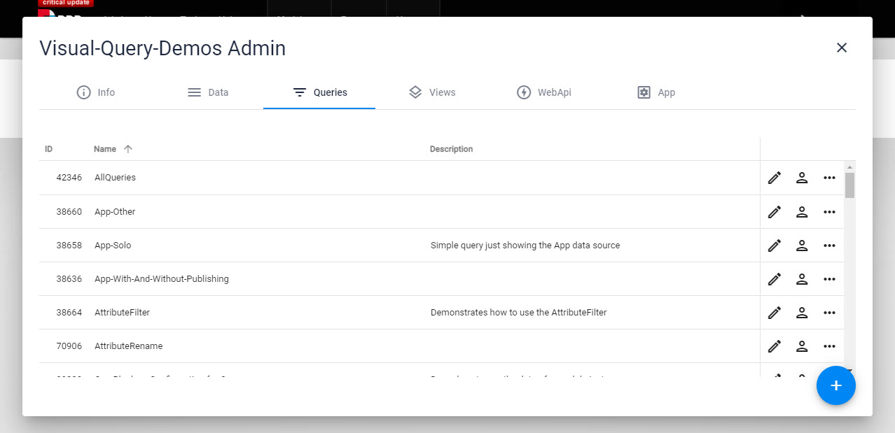
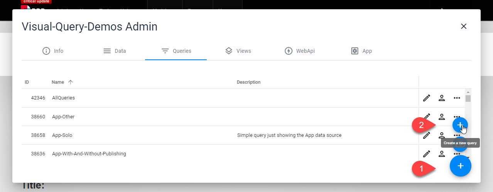

# Query and VisualQuery

[!include]

2sxc Templates and Headless APIs can use **Queries** to access data. This is pretty amazing:

1. You create such queries using a **[VisualQuery](xref:Basics.Query.VisualQuery.Index)** designer
1. Queries can then be [assigned to a View](xref:Basics.Query.QueryInView) so the template recieves this as the data to work with
1. Queries can also be used directly in the [Headless API](xref:WebApi.Headless.Index) if you configure the permissions for this
1. The Edit-UI can also [use queries in dropdown fields](xref:Basics.Query.EditForm)
1. You can also access queries using [App.Query["QueryName"]](xref:NetCode.DynamicCode.Objects.App.Query)

In addition, there are also some built-in [System Queries](xref:Basics.Query.SystemQueries) built-in which will get system data for you like a list of Content-Types or Apps in the System.

> [!TIP]
> Note that Queries can created in code and using VisualQuery.
> The code method is very advanced. You can read more about [using DataSources in C# / Razor code](xref:NetCode.DataSources.Use.Guide).
> The rest of this page is about VisualQuery.

## Queries in an App

All Queries (except for the System-Queries) are stored in the App - this is what it looks like:

## Create Queries

To create a new Query hit the + and continue from there:

## Edit Queries

Use the [VisualQuery Designer](xref:Basics.Query.VisualQuery.Index)

## Export / Import

👉 

## Technical Implementation

When queries run they behave like [Data-Sources](xref:NetCode.DataSources.Index) while internally chaining various other Data-Sources to query the underlying data.

---

## History

* introduced in 2sxc 6
* continuously enhanced
