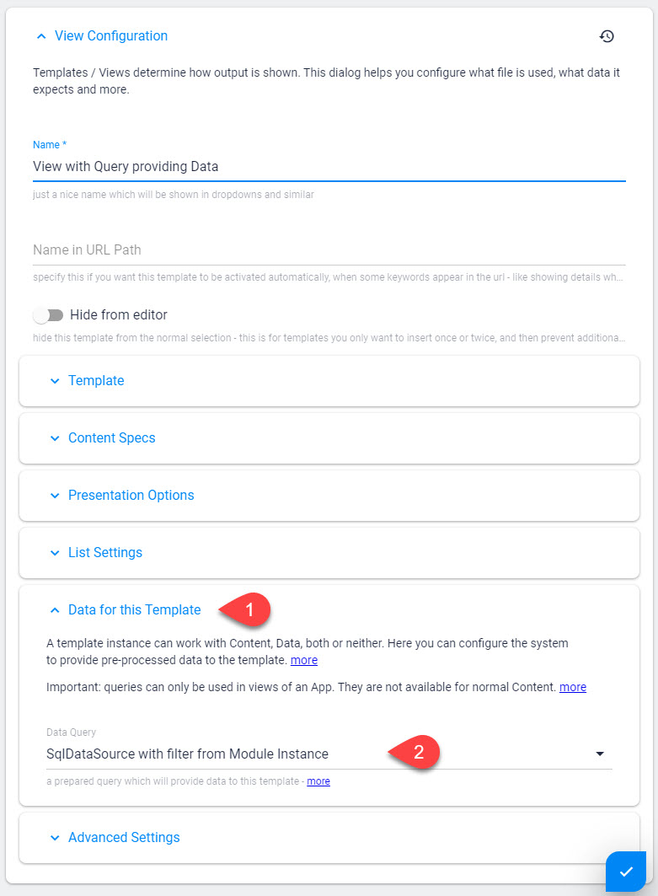

# Export / Import Queries

[!include]

The most common way to use Queries is as a Data provider for a [View](xref:Basics.App.Views.Index). 

In such a case, the View will recieve data as the Query processes it, and can template it as needed. 

## Configure in the UI

In a View configuration, this is where you tell it to use a Query to provide data: 

---

## History

1. Introduced with Queries ca. 2sxc 6
