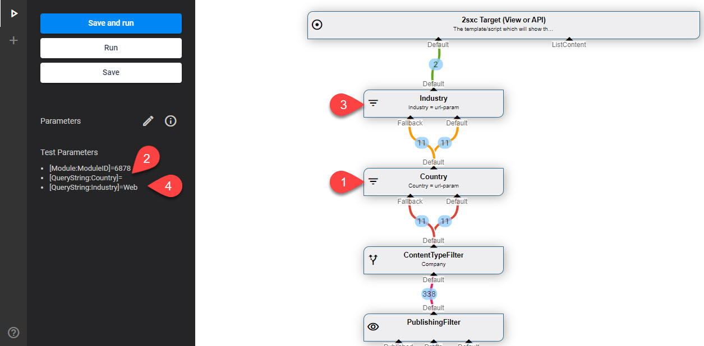

# VisualQuery: In Streams

[!include]

**DataSources** often have **In Streams**. Some are required and some are optional. There are three common cases:

1. No In-Streams because the DataSource generates data (eg. the [Sql DataSource](xref:ToSic.Eav.DataSources.Sql))
1. In-Streams which **supply data for processing**
1. In-Streams which simply **supply configuration**

The counterpart of In-Streams are [Out-Streams](xref:Basics.Query.Streams.Out).

This is what In-Streams look like in VisualQuery:

## The Three Common Cases

### Case 1: DataSources without In-Streams

Root DataSources generate or get data, and don't need an In-Stream. Here's an example from a [CSV DataSource](xref:ToSic.Eav.DataSources.Csv).

### Case 2: In-Streams for Data Processing

This is a most common case, where a datasource gets one or more streams, and filter or modify the content. Here's an example of the [StreamPick](xref:ToSic.Eav.DataSources.StreamPick) DataSource which has 3 inbound streams, and picks the one called `Default` to pass on:

### Case 3: In-Streams for Configuration

In addition to data providing In-Streams, a DataSource may also use the data from an `In` to get a setting. 

<!-- #todoc 

- add image
- explain a bit
-->

In these cases the _first item_ in the stream can be used as a parameter in the Settings using **In-Lookups** like `[In:Module:Category]`. Read more about [In-LookUps](xref:Abyss.Parts.LookUp.In).

## In-Stream Names

The names on an In-Stream are important since they affect how the stream is used. 

Note that the names must be unique. This is case-insensitive, so `Default` and `default` are regarded as the same name and wouldn't be valid. 

### Pre-Named In-Streams

If the DataSource has special In-Streams which have a pre-defined purpose they are pre-named. This example of the [ValueFilter](xref:ToSic.Eav.DataSources.ValueFilter) DataSource can run a filter on `Default`, and if it ends up empty, can deliver a `Fallback` stream:

1. The Country filter - it didn't find anything in the `Default` for the filter, so it receives 11 items and forwards 11 items from the `Fallback`
1. Test data for Country is blank
1. The Industry filter - it did find something, so it only forwards the 2 matching items
1. Test data for the Industry expects `Web`

### Dynamic In-Streams

Some DataSources can handle an infine amount of `In`-Streams like the [StreamPick](xref:ToSic.Eav.DataSources.StreamPick) DataSource. This is indicated by the orange 🔺 on mouse-over:

This means you can connect as many In-Streams as you want. Just make sure the names are unique. 

### Rename In-Streams

You can always rename a connection by clicking on the name and typing in a new name. 

## Required vs. Optional In-Streams

Some streams are optional, some are required. In the example of the **ValueFilter** above, the `Default` is required, and the `Fallback` is optional. 

## In-Streams Cannot be Re-Used

An [Out-Stream](xref:Basics.Query.Streams.Out) can be connected to multiple [In-Streams](xref:Basics.Query.Streams.In) but the opposite is not possible. 
So an In can only have one source, but an Out can give it's data to multiple In sources. 

## Nice to Know

1. By convention, the default In-stream is called `Default`
1. In-Streams have data which can be used, but they are not accessed until you really need them

## History

1. Introduced ca. in 2sxc 6
1. Dynamic-In has existed since 2sxc 6 but the visual queue was added in 2sxc 11.13