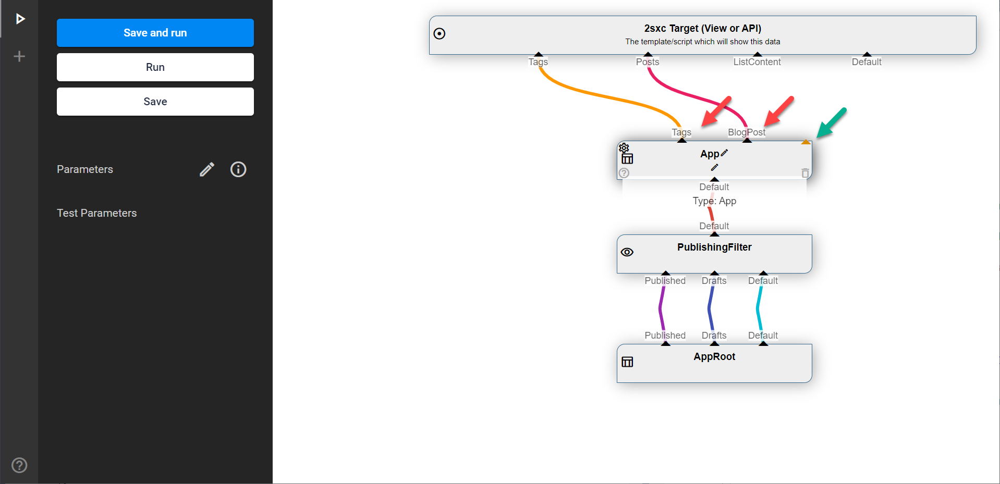

# VisualQuery: Out Streams

[!include]

All DataSources must have **Out** Streams.

By convention, the primary Out is called `Default`.

Such a Stream will contain zero, one or many Entities (items of data) depending on the logic in the DataSource and the data/configuration which was handed in. 

The counterpart of Out-Streams are [In-Streams](xref:Basics.Query.Streams.In).

## Out Streams in VisualQuery

These are predefined `Out` Streams where each DataSource declares what it can offer:

Some Sources can have _Dynamic Out_ where you can create as many Out streams as you want. Usually the name you give each stream will affect what is in it:

## Rename Out-Streams

You can always rename a connection by clicking on the name and typing in a new name. 

## Out-Streams are Run Once

If an Out-Stream is accessed in a web-request it will run the code to create the Stream. 
If it is accessed again (re-used) within the same request, it will simply return the data from the first run. 

## Out-Streams are Lazy

An **Out-Stream** offers Data, but the underlying code is not executed unless accessed. This is for performance reasons. 

For an **Out-Stream** to be accessed, it must be connected to one or more [In-Stream](xref:Basics.Query.Streams.In) of other DataSource which in turn are accessed. 

Note that when debugging in VisualQuery, all Out-Streams of the final target are accessed to show statistis, but if the Query is used elsewhere very often not all streams are accessed. 

## Unused Out-Streams

If an out-stream is not connected to anything, it's not used and the underlying code which generates this data will not be accessed. 

## Out-Streams can be Reused

An [Out-Stream](xref:Basics.Query.Streams.Out) can be connected to multiple [In-Streams](xref:Basics.Query.Streams.In) but the opposite is not possible. 
So an In can only have one source, but an Out can give it's data to multiple In sources. 

The underlying code will still only be run once. 

---

## History

1. Introduced ca. in 2sxc 6
1. Extended with Dynamic Out ca. 2sxc 8