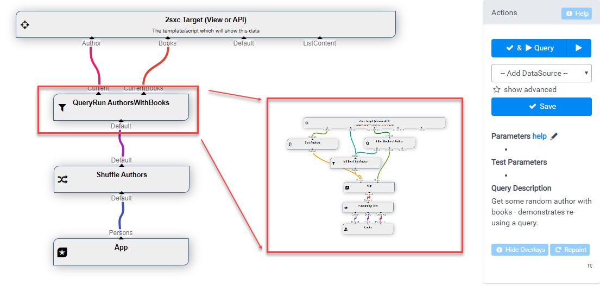

# Sub-Queries: Re-Use Queries in Other Queries

[!include]

You can re-use a Query inside another one, just like calling functions in your code. 

This feature uses the [QueryRun DataSource](xref:ToSic.Eav.DataSources.QueryRun).

## Example in VisualQuery

As you'll see in the image below, the QueryRun DataSource actually runs another query and re-uses it. 

## Walkthrough Video

Watch this video for a walkthrough to learn how to use it yourself.

<iframe style="align: right;" src="https://www.youtube.com/embed/1jaoh6Hu_ao" width="100%" height="315" frameborder="0" allowfullscreen="allowfullscreen"></iframe>

## Checklist to Use Sub-Queries

<iframe style="box-shadow: 0 1px 3px rgba(60,64,67,.3), 0 4px 8px 3px rgba(60,64,67,.15);" src="https://azing.org/2sxc/r/EYQhRhwY?embed=1" width="100%" height="400" frameborder="0" allowfullscreen="allowfullscreen"></iframe>

## Best Practices

In many cases you'll have sub-queries which expect parameters. 
You could assume that they come from the URL like `[QueryString:Id]` but when re-using the query it's better to pass it through the parameters because it will give the caller more control over what parameters are used. In the above example, it's better to do this:

1. The sub-query would use `[Params:Id]` to use the Params-ID
1. The caller would then set `Params:Id=[QueryString:Id]` or anything else as needed

---

## History

* Introduced in 2sxc 10.24