# VisualQuery Designer

[!include]

2sxc includes a visual designer for creating queries called **VisualQuery**. It's drag-and drop, and each component can be configured to your needs. 

## The Designer

This is what it looks like:

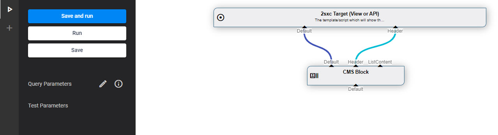

This is what you see when you run a query:

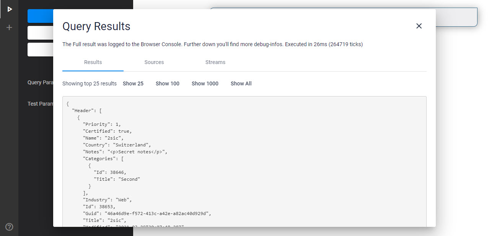

## Add Parts / DataSources

Just add parts to your query as you need them: 

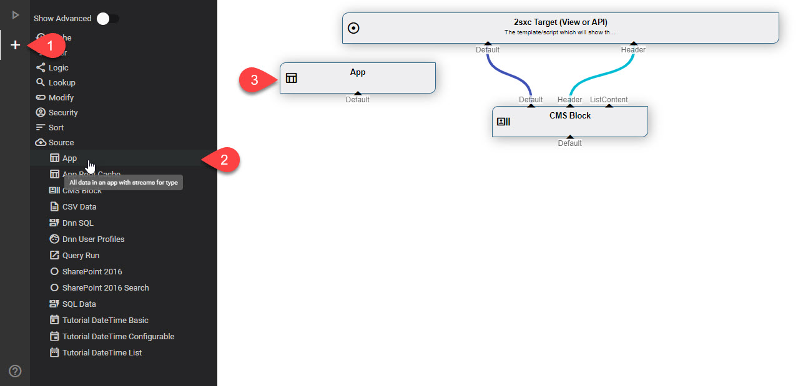

...and drag them around for positioning as you want:

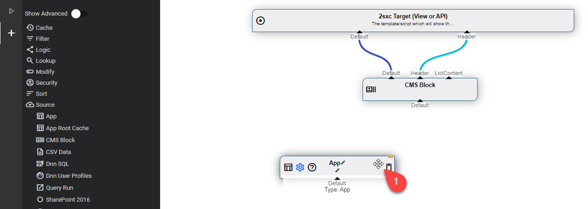

## Connect Parts / DataSources

Now just connect [Out Streams](xref:Basics.Query.Streams.Out) of some parts to the [In Streams](xref:Basics.Query.Streams.In) on other parts:

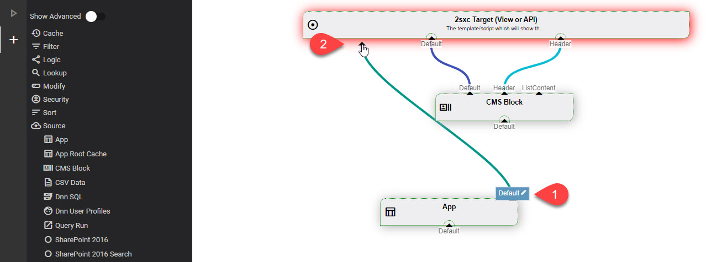

In some cases, the connection to drop unto already has the right name, otherwise just click on the name to rename it:

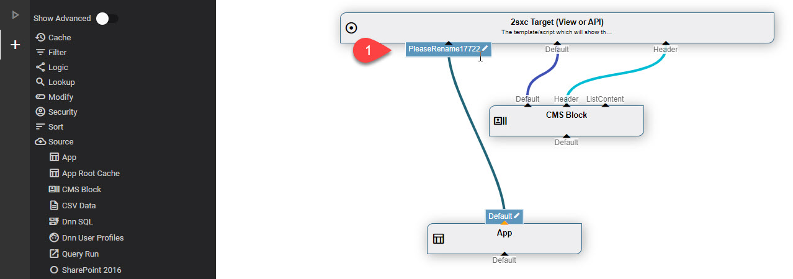

> [!TIP]
> Renaming connections can be very important, as the receiver of data may expect a specifically named [In Stream](xref:Basics.Query.Streams.In) to bring it data. The most common name is `Default` BTW.

You can also rename the Outbound connection if you want this:

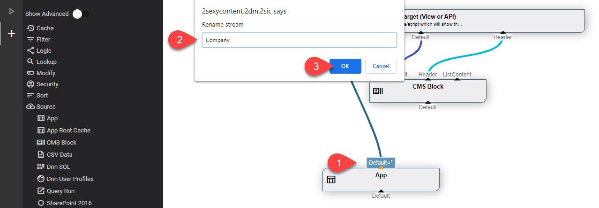

> [!TIP]
> Just like the In-Streams, the [Out-Streams](xref:Basics.Query.Streams.Out) names can have an important effect. In the example above, renaming the Out means that the shown **App DataSource** will only give data of the type `Company` on this stream.

## Save, Run and Debug

Here's an example of the result after running the query shown above:

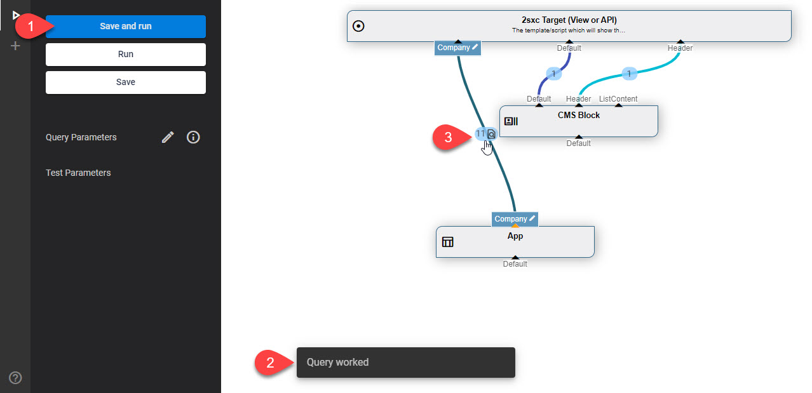

As you can see, the designer shows each connection and how much data was in it (and you'll see a dialog showing the data). If we click on a stream we can also see exactly what was in the stream:

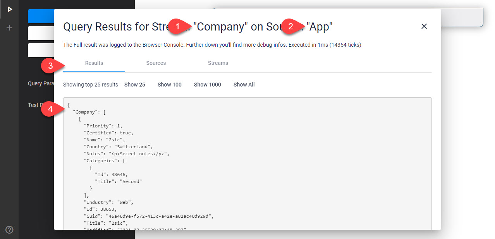

Read more about this in .

## Add more DataSources and Connect

To build your dream-query, add more parts as you need them...

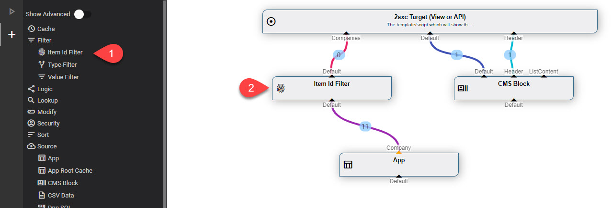

As you can see, the resulting stream has 0 items in it. Let's configure the Item-ID Filter to do something usefull:

## Configure the Parts

All parts which can be configured show a gear-icon when you mouse over them:

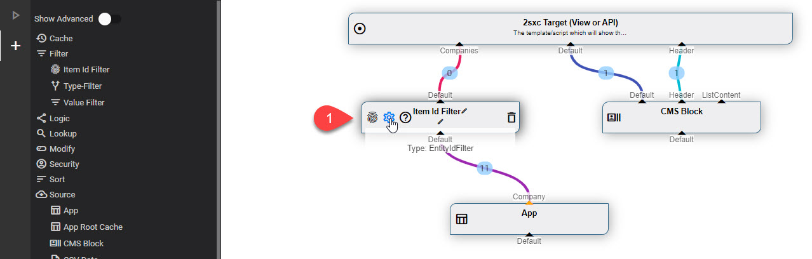

...which then show a dialog for this specific DataSource:

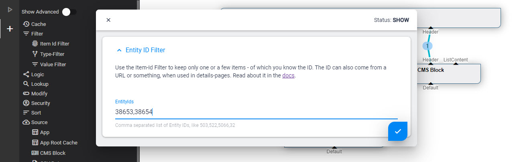

👉 Learn more about [Configuration and Parameters](xref:Basics.Query.Parameters.Index)

## Where to go from Here

1. Try out various apps to see how they use VisualQuery
1. Discover all the features in these docs (see menu to the left)

## Read also

* [Blog Posts about VisualQuery Designer](https://2sxc.org/en/blog/tag/visual-query-designer)
* 

## History

1. Introduced in 2sxc 07.00

