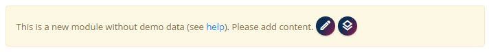
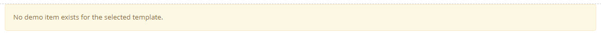
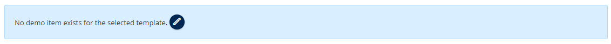

# Common Problem: No Demo Data

Sometimes you will see a message like this when adding a module to a page (v17.06+):

Or for v16 and earlier:

Or for v14 and earlier:

This is because a view can be configured to get data in many ways.
The message you see indicates that you configured a view to have **own data**
so the system assumes that your Razor template will try to visualize the data.

Now if the module was just added, it may not have any data yet to visualize.
Since the configuration assumes **own data** it will only show something, if there is data available.
This is to prevent the Razor from throwing errors when trying to access non-existing data.

To correct this, you have two options:

1. **Add an item to the _current module_** using the toolbar edit button.
1. **Add a Demo Item to the _view configuration_**, so that there is always something to visualize.

---

Shortlink: <https://go.2sxc.org/no-demo-data>
