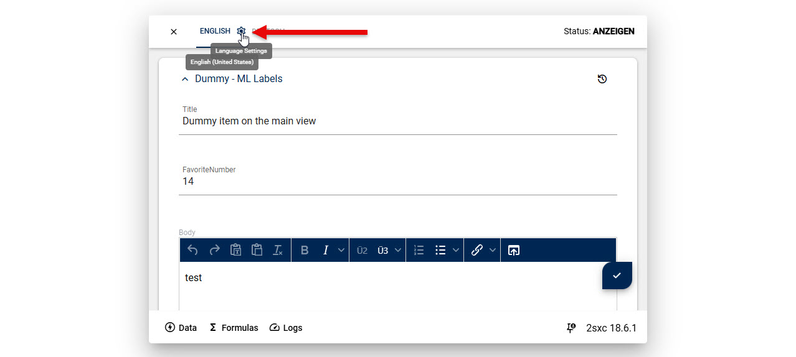
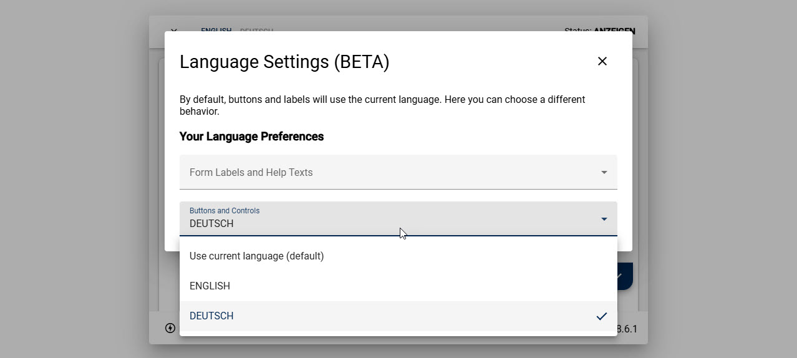

# Edit - Dialog Settings (beta v19)

In v19 we're trying to allow more control over what the dialog provides.

A feature which is still in beta, is to control which languages
are used to show labels, help-texts, buttons etc. in the dialog.

## Standard Setup

By default, the user can customize his preferred languages in the dialog settings.

<div gallery="main">
  
  
</div>

Now there are probably special cases, where these settings should be provided by the
opening button, or possibly prevent the user from changing them.

> [!WARNING]
> This is still experimental, and the details could change in future versions.

## Customizing the Dialog

This would create a toolbar which would open the dialog with the specified language settings:

```razor
<!-- set only the UI language -->
@Kit.Toolbar.Empty().Edit(itemToCopyTyped,
  tweak: t => t.Parameters(new {
    dialogSettings = new {
      languageUi = "de-de",
    }
  })
)

<!-- set the UI language and the form-language -->
@Kit.Toolbar.Empty().Edit(itemToCopyTyped,
  tweak: t => t.Parameters(new {
    dialogSettings = new {
      languageUi = "de-de",
      languageForm = "en-us"
    }
  })
)
```

This would open the dialog with the specified language settings, and prevent the user from changing the UI language:

```c#
@Kit.Toolbar.Empty().Edit(itemToCopyTyped,
  tweak: t => t.Parameters(new {
    dialogSettings = new {
      languageUi = "de-de!",
      languageForm = "en-us"
    }
  })
)
```

This would simply disable the user settings:

```razor
@Kit.Toolbar.Empty().Edit(itemToCopyTyped,
  tweak: t => t.Parameters(new {
    dialogSettings = new {
      languageUserSettings = false
    }
  })
)
```

This would combine the preset with deny-change.
Note that we're still using the `!` to indicate that the user can't change the UI language.
This is because the user could have configured these settings in a previous dialog, so then those settings would still apply.

```c#
Kit.Toolbar.Empty().Edit(itemToCopyTyped,
  tweak: t => t.Parameters(new {
    dialogSettings = new {
      languageUserSettings = false,
      languageUi = "de-de!",
      languageForm = "en-us"
    }
  })
)
```

---

## History

* Introduced in 2sxc 18.06 as _beta_
