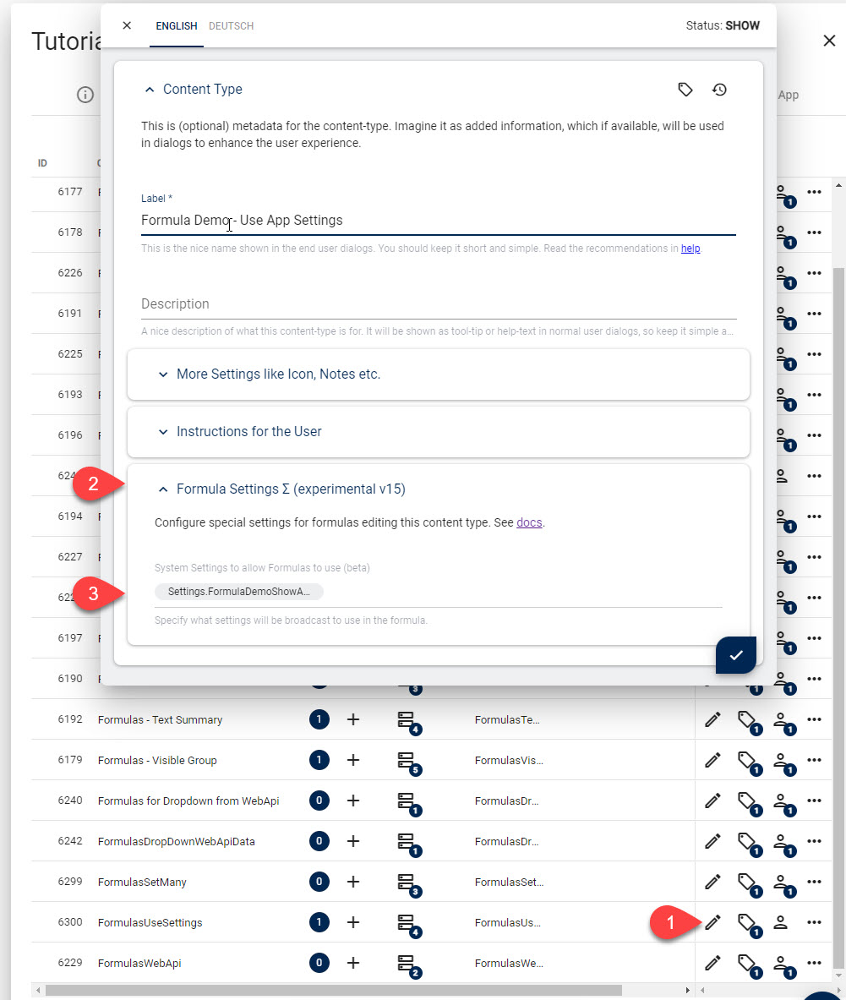

# Use App Settings in Formulas

Sometimes your App will have [App Settings](xref:Basics.App.Settings) to configure how it should behave.
In Razor, there was always an API to read the setting so the output could react to this.

In v16 you can also use these settings in formulas, so you can do things like this:

```js
var showAdvanced = context.app.getSetting("Settings.FormulaDemoShowAdvanced");
```

This allows your UI to show/hide fields based on activated features.
It also lets you specify all kinds of things in a central manner.

## Prerequisite: Specify what Settings are available

For security reasons, the API can't read any settings by default.
This is because Formulas run in the context of the current editor, and some settings are sensitive.

So to enable the settings, you must first specify which settings are available.
You can do this in the ContentType configuration here:



You can specify any App Setting as well as Site or Preset settings here from the [Settings Stack](xref:Basics.Configuration.Index).

## Create the Formula

Here's an example as it's shown in the tutorial (it controls the `Visible` property of a field):

```js
v2((data, context) => {
  return context.app.getSetting("Settings.FormulaDemoShowAdvanced");
});
```

> [!TIP]
> Every setting must be prefixed with `Settings.` for now.

---

## History

* Introduced in 2sxc 16.00
