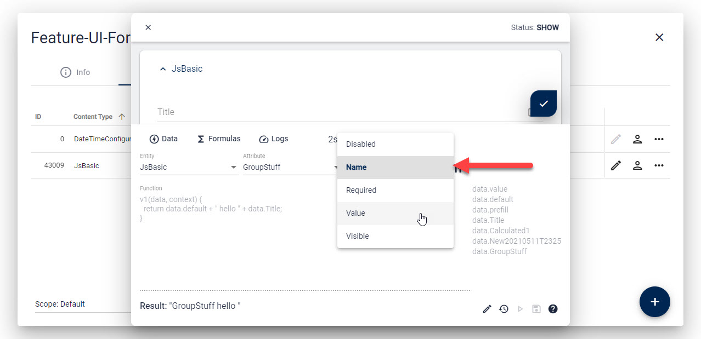

# Formula Designer

[!include]

In the Edit-UI you can always enter a Developer-Mode to develop / debug your formulas using real life data.

## Enter Developer Mode

When the edit form is open, press **Ctrl + Alt + Shift** (Ctrl + Option + Shift on Mac) and click anywhere in the form. The debug bar should appear.
If you have difficulties, use [this checklist](https://azing.org/2sxc/r/Lh88MFoT).

## Select Formula to work On

In the dialog you'll see dropdowns to select the entity, field and property. Things that already have a formula are bold:

## The Formula Designer

These are the important parts in the UI:

1. Tab for the **Formula Designer**
2. Tab for **logs/errors** caused by formulas
3. **Pick the Entity** on which to edit a formula - this often has only 1 entry
4. **Pick the Field** on which to edit the formula
5. **Pick the Property** or select **Value** to determine what the formula affects
6. Free-Text entry to create formulas for other properties. Use `Fields.Settings.SettingName`
7. **Help**
8. **Formula code** - see [JS Formulas docs](xref:JsCode.EditForm.Formulas.Index)
9. **Data-Snippets** showing you what the `data` object has for use in your code  
   This is only visible in v1, but not in v2, as v2 has intellisense and doesn't need this
10. **Results** (live) when the formula is running to show what came out of it
11. **Edit** to enter formula edit mode
12. **Reset** the formula to what it was originally
13. **Save**
14. **Play** / **Run** the formula

## Debug Formulas

By default, as soon as you're working on a formula, it will dump the `data`, `context` and `result` to the console once it's running.
This is what that looks like (Make sure to enter developer mode in Chrome using F12):

You can also to do additional debugging. For that please consult the [JavaScript Formulas Docs](xref:JsCode.EditForm.Formulas.Index)

---

## History

* Added in 2sxc 12.01
* Ability to also create new formulas directly in the UI ca. 2sxc 14
* Enhanced new v2 API in 2sxc 15.7 - officially released in 16.0
