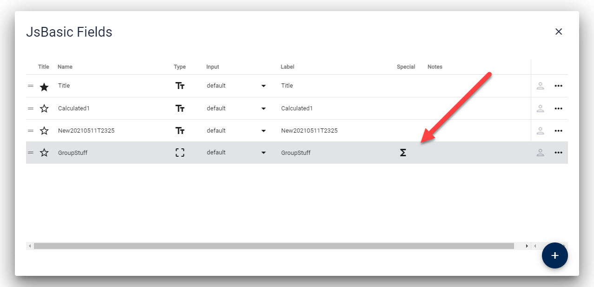

# Where Formulas are Stored

[!include]

Formulas are stored as Field Metadata as part of the Content-Type.
If ever you need to do some manual operations (which you shouldn't need to do), you can find them here:

> [!TIP]
> Normally you will just add/edit formulas in
> [Interactive Formula Designer](xref:JsCode.EditForm.Formulas.Designer.Index)

As shown in this image, all fields having formulas are easy to discern:

You can create or edit Formulas them in the general field settings:

---

## History

* Introduced in 2sxc 12.01
* Extended with `Required` ca. v13.00
* Extended with `Notes` ca. v13.10

Shortlink to here: https://go.2sxc.org/formulas