# Razor with Typed Models in 2sxc 17+

In 2sxc 17+ you can use strong-typed models in your Razor files.

## Background

You will often split your code into multiple Razor files and pass parameters to child components:

```mermaid
flowchart LR
    CS[Entry Razor\nList.cshtml] -->|📤Flexible Parameters| XD
    XD["Child Razor\nList-Item.cshtml"]
```



The caller `List.cshtml` usually does this:

```razor
@Html.Partial("List-Item.cshtml", new { Title = "Something", Product = product })
```

The child component `List-Item.cshtml` would then pick this up with differing syntaxes - here's a `RazorTyped` example:
  
```razor
@inherits Custom.Hybrid.RazorTyped
@{
  var title = MyModel.String("Title");
  var product = MyModel.Item("Product");
}
```

This is great, and ideal for flexible scenarios.

## New: Typed Models

But we wanted to introduce more type safety, so we created the `RazorTyped<TModel>` base class.

### Simple String Example

```mermaid
flowchart LR
    CS[Entry Razor\nList.cshtml] -->|📤String Parameter| XD
    XD["Child Razor\nList-Item.cshtml"]
```



The caller `List.cshtml` would now do this:

```razor
@Html.Partial("List-Item.cshtml", "Something")
```

The child component `List-Item.cshtml` would then pick this up with differing syntaxes - here's a `RazorTyped` example:
  
```razor
@inherits Custom.Hybrid.RazorTyped<string>
@{
  var title = Model;
}
```

Note that `MyModel` still exists, but isn't made to handle single values.
But the `Model` variable is what is typed with the `RazorTyped<string>`.

### Simple Item Example

```mermaid
flowchart LR
    CS[Entry Razor\nList.cshtml] -->|📤Product| XD
    XD["Child Razor\nList-Item.cshtml"]
```



The caller `List.cshtml` would now do this:

```razor
@Html.Partial("List-Item.cshtml", product)
```

The child component `List-Item.cshtml` would then pick this up with differing syntaxes - here's a `RazorTyped` example:
  
```razor
@inherits Custom.Hybrid.RazorTyped<Product>
@{
  var product = Model;
}
```

### Complex Example

```mermaid
flowchart LR
    CS[Entry Razor\nList.cshtml] -->|📤Product View Model| XD
    XD["Child Razor\nList-Item.cshtml"]
```



You would now have another class `/AppCode/Razor/ProductViewModel` which would be a strong-typed model.

```c#
namespace AppCode.Razor
{
  public class ProductViewModel {
    public string Title { get; set; }
    public Product Product { get; set; }
  }
}
```


The caller `List.cshtml` would now do this:

```razor
@Html.Partial("List-Item.cshtml", new ProductViewModel { Title = "Something", Product = product })
```

The child component `List-Item.cshtml` would then pick this up with differing syntaxes - here's a `RazorTyped` example:
  
```razor
@inherits Custom.Hybrid.RazorTyped<ProductViewModel>
@using AppCode.Razor
@{
  var title = Model.Title;
  var product = Model.Product;
}
```

## Pick your Poison

This new feature is great, but it's not for everyone.
It takes a bit more work, but introduces type safety and IntelliSense to your Razor files.
It also plays well with the new [Razor Base Classes](xref:NetCode.StrongTypedCode.RazorBaseClasses).

---

## History

* Introduced in v17.03
