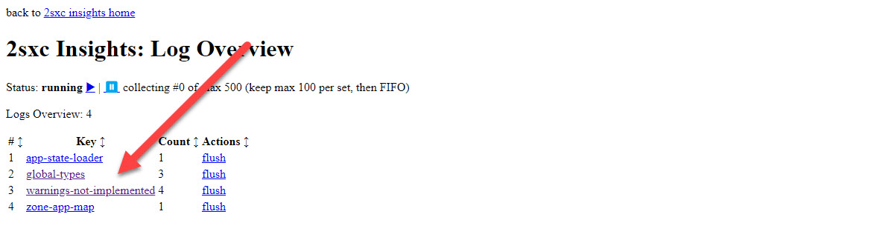
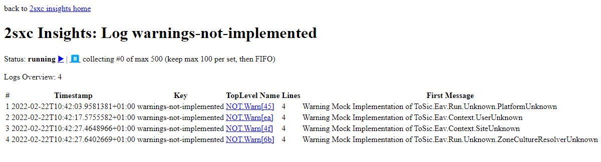

# Convention: Unknown Implementations

[!include["This is for integration only"](../_include-for-integration.md)]

EAV and 2sxc have about 30 objects which can be implemented specifically to a platform.
Examples:

* `ISite` gives information about the current site
* `IUser` gives information about the current user
* `IEnvironmentPermission` determines if certain user permissions are given (like Edit rights)

To make integration easier, these objects have an `...Unknown` implementation which is registered if you didn't specifically provide a custom implementation first. Examples:

* `SiteUnknown` will be auto-registered, always reporting Id: -2742 and ZoneId: 2
* `IUserUnknown` will always say that it's not a Admin

Because they are auto-registered as a fallback, they will be used if you didn't provide your own implementation.
This ensures that even minimal integrations can work, but will be missing some functionality.

## Warnings when Unknown Objects are Used

All the unknown objects will add a warning to the Insights-log, so you can see that these objects were used.
You will see an entry for `warnings-not-implemented`

## Which Objects to Replace

As you integrate 2sxc/EAV on your platform, you will probably not implement all these services, as you won't need them all.
But it's a good idea to keep an eye on the logs, to determine if a specific object should be implemented.

---

## History

* Introduced when integrating Oqtane in 2sxc 12
* final docs in v13.03

Coverage: ca. 100% of relevant objects implement this

Shortlink: <https://go.2sxc.org/unknown-implementations>
