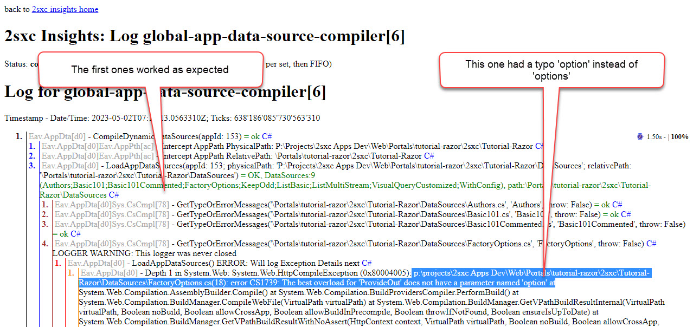

# Custom Dynamic DataSources 🆕 v16

[!include[](~/pages/basics/stack/_shared-float-summary.md)]
<style> .context-box-summary .datasource-custom { visibility: visible; } </style>

**Dynamic DataSources** are a new, simpler way to create DataSources.
This is a new feature in 2sxc 16.

These data sources are simple `.cs` files in the `DataSources` folder of the App.
They are compiled on the fly and can be edited in the browser or VS Code.

> [!TIP]
> This is new in v16 and is the recommended way to create custom DataSources.
>
> This is also the recommended way to get started and learn about DataSources.

An important feature/limitation of this is that the DataSource can only be used in that single App.
This is often preferred, as it can be distributed together with the App and won't affect any other Apps.

Here is a very simple example of a dynamic DataSource:

```cs
using System.Linq;

public class ListBasic : Custom.DataSource.DataSource16
{
  public ListBasic(MyServices services) : base(services)
  {
    ProvideOut(() => Enumerable.Range(1, 5).Select(i => new {
      Id = i,
      Guid = System.Guid.NewGuid(),
      Title = "Hello from ListBasic",
      FavoriteNumber = 2742,
    }));
  }
}
```

## Differences to Compiled DataSources

The main difference is that the Dynamic DataSource is compiled on the fly, and that it's only available in that App.
The main advantage is that it's much simpler to create and maintain.

💡 Dynamic DataSources always inherit from `Custom.DataSource.DataSource16`

Advantages

1. Very easy to start with
1. Very easy to maintain
1. Changes can be made on the fly without restarting the server in the browser or using VS Code
1. It has various helpers which make it much easier to code

Disadvantages

* it's only available in that App
* it's not pre-compiled, so if your code is buggy, you need to see the errors in Insights which can be a bit more difficult
* it can't be unit tested
* it's not ideal for large, sophisticated code

Comparable

* both can be used in VisualQuery
* both can be used in Razor and WebApi

## Get Started

1. First you should review the live samples in our [](xref:Tut.DynamicDataSources)
1. Then you should try to create your own 😉

## Tips / Common Issues

1. Dynamic DataSources must always be in the `DataSources` folder of the App
1. The name of the code file (eg. `MyDs.cs`) must match the class name (eg. `class MyDs`)
1. The `ProvideOut(...)` expects a function name or lambda expression, so you must use `() => ...` and not just `...`
1. If your code wants to use [Configuration](xref:NetCode.DataSources.Custom.Configuration) make sure you access that within the `ProvideOut` function, not in the constructor itself

## Handling Compile Issues with Insights

You will make mistakes, and you will run into compile errors.
But the DataSources are invisible, so you won't see the error on your Razor page.

To see the compile errors, you must go to the [2sxc Insights](xref:NetCode.Debug.Insights.Index) and look at the log, eg.:



## History

1. Introduced in 2sxc 16
