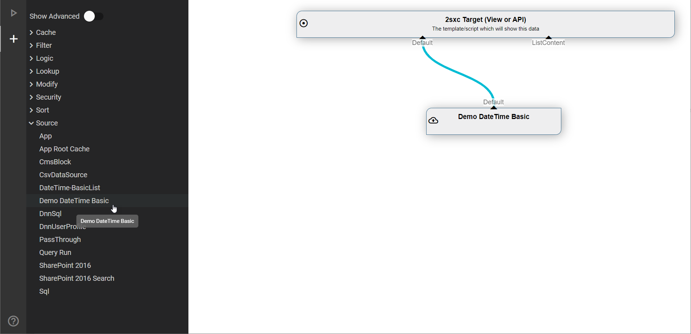
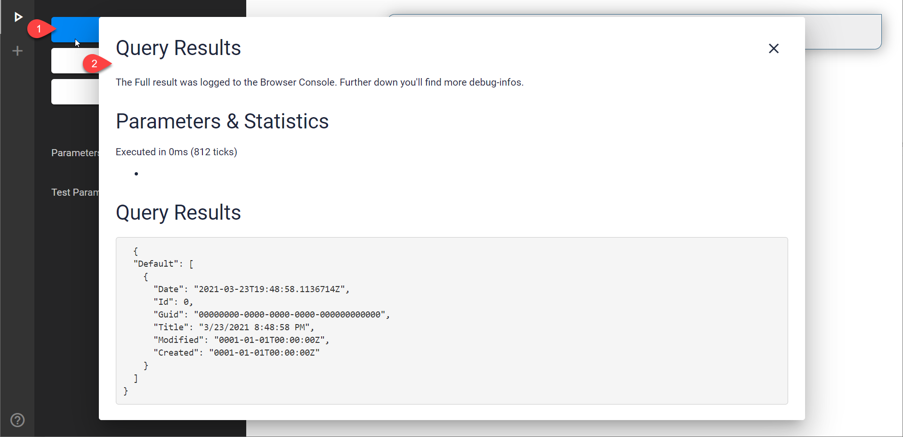

# Custom DataSources

[!include]

If you want to create your own DataSource and use it in C# or the VisualQuery designer, this is for you.

## Get Started

🎓 Start with our [Custom DataSource Guide](xref:NetCode.DataSources.Custom.Guide.Index)

🗺️ Continue with the [Big Picture](xref:NetCode.DataSources.Custom.Guide.BigPicture)

🚀 Then start to [Create DataSources](xref:NetCode.DataSources.Custom.Create)

For everything else, continue with the buttons in the menu to the left...

## Use in VisualQuery Designer

This is what the DataSource would appear like in VisualQuery

...and this is what the test-run would look like

## Read More

* [Blog about this feature](https://2sxc.org/en/blog/post/tutorial-custom-datasources-for-eav-2sxc-9-13-part-1)
* [Blog post about custom DataSources](xref:Blog.CustomDataSource)

## History

1. Introduced in 2sxc ca. 4 but with a difficult API
1. API strongly enhanced and simplifield in 2sxc 09.13
1. Another API rework ca. 2sxc 10.25 (but we're not exactly sure)
1. Major breaking API changes and improvements in 2sxc 15
1. Dynamic DataSources introduced in 2sxc 16

Shortlink: <https://go.2sxc.org/DsCustom>
