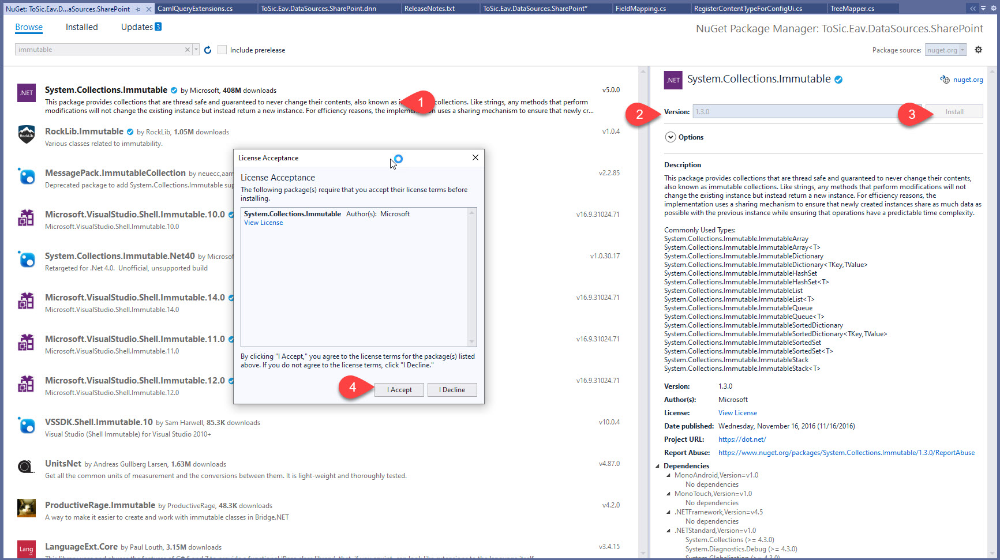

[!include]

# DataSource API: About Immutable Data

[!include]

All Streams are internally immutable, and we recommend that you also use Provide with an immutable List. This is _not required_ but best-practice.

If you want to do this, make sure you use a similar version of the Immutable NuGet package as used in EAV.

Internally the version is marked as 1.2.1, but the NuGet is actually 1.3.0.

## History

1. Introduced ca. EAV / 2sxc v11
