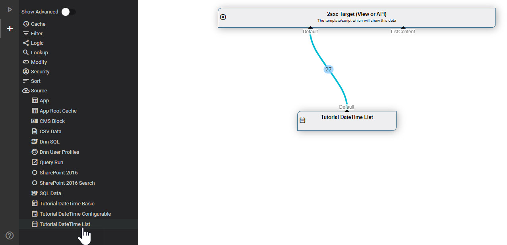
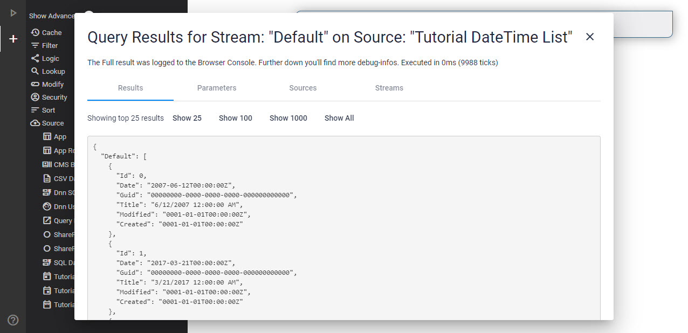

[!include[](_obsolete-docs.md)]

# Tutorial Custom DataSources - BasicList

This explains the **BasicList** DataSource in the [DataSource Tutorial](xref:NetCode.DataSources.Custom.TutorialBasic.Index).

## Add to VisualQuery

This is what it looks like in [VisualQuery](xref:Basics.Query.VisualQuery.Index):



And this is what you see when you run it:



## Source of the `BasicList` DataSource

This is the code for the simplest DataSource:

```c#
using System;
using System.Collections.Generic;
using System.Collections.Immutable;
using ToSic.Eav.Data;
using ToSic.Eav.DataSources;
using ToSic.Eav.DataSources.Queries;

namespace ToSic.Tutorial.DataSource.Basic
{
  // additional info so the VisualQuery can provide the correct buttons and infos
  [VisualQuery(
    NiceName = "Demo DateTime List",
    Icon = "date_range",
    NameId = "10ebb0af-4b4e-44cb-81e3-68c3b0bb388d"   // random & unique Guid
  )]
  public class DateTimeDataSourceBasicList: ExternalData
  {
    public const string DateFieldName = "Date";
    public const string IdField = "Id";
    public const int ItemsToGenerate = 27;

    /// <summary>
    /// Constructor to tell the system what out-streams we have
    /// </summary>
    public DateTimeDataSourceBasicList()
    {
      Provide(GetList); // default out, if accessed, will deliver GetList
    }

    /// <summary>
    /// Get-List method, which will load/build the items once requested 
    /// Note that the setup is lazy-loading,
    /// ...so this code will not execute unless it's really used
    /// </summary>
    /// <returns></returns>
    private ImmutableArray<IEntity> GetList()
    {
      var randomNumbers = new List<IEntity>();

      for (var i = 0; i < ItemsToGenerate; i++)
      {
        var values = new Dictionary<string, object>
        {
          {IdField, i},
          {DateFieldName, RandomDay()}
        };
        var ent = DataBuilder.Entity(values, id: i, titleField: DateFieldName);
        randomNumbers.Add(ent);
      }

      return randomNumbers.ToImmutableArray();
    }

    // helper to randomly generate dates
    private readonly Random _randomizer = new Random();
    private readonly DateTime _start = new DateTime(1995, 1, 1);

    private DateTime RandomDay()
    {
      var range = (DateTime.Today - _start).Days;
      return _start.AddDays(_randomizer.Next(range));
    }
    
  }
}
```

This is very similar to the [Basic](xref:NetCode.DataSources.Custom.TutorialBasic.Basic) case, just that we're now creating a list of Entities and returning them.

What this does is...

1. Inform [VisualQuery](xref:Basics.Query.VisualQuery.Index) that there is a DataSource and registers it with a unique GUID
1. The constructor says it [provides](xref:NetCode.DataSources.Custom.PreV15.Provide) one `Default` stream which can be built by `GetList()`
1. `GetList()` will simply create a simple entity and return it as a list

---

## Read More

* Discover the [Basic DataSourceTutorial](xref:NetCode.DataSources.Custom.TutorialBasic.Index) with more examples

## History

1. Created 2017 for 2sxc 7
1. Completely rebuilt for 2sxc 11.13 and [VisualQuery](xref:Basics.Query.VisualQuery.Index) 3

