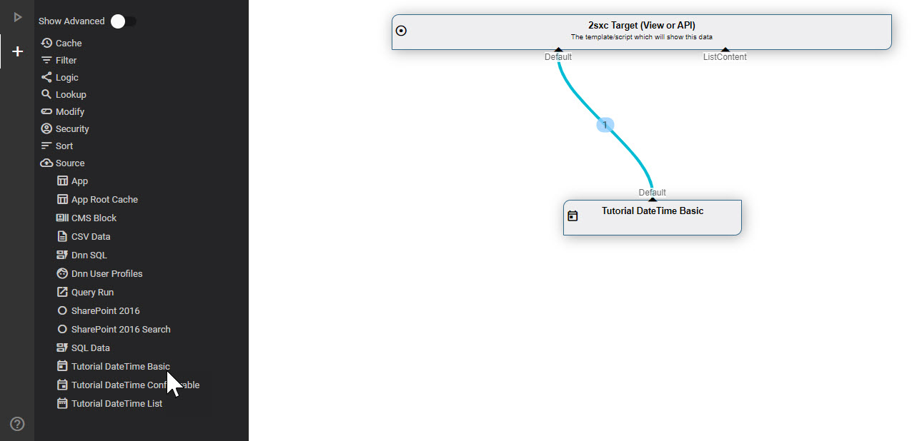
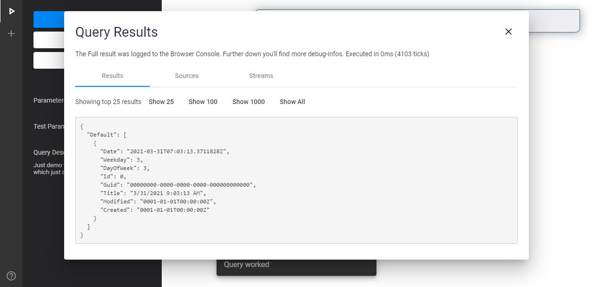

[!include[](_obsolete-docs.md)]

# Tutorial Custom DataSources - Basic

This explains the **Basic** DataSource in the [DataSource Tutorial](xref:NetCode.DataSources.Custom.TutorialBasic.Index).

## Add to VisualQuery

This is what it looks like in [VisualQuery](xref:Basics.Query.VisualQuery.Index):



And this is what you see when you run it:



## Source of the `Basic` DataSource

This is the code for the simplest DataSource:

```c#
using System;
using System.Collections.Generic;
using System.Collections.Immutable;
using ToSic.Eav.Data;
using ToSic.Eav.DataSources;
using ToSic.Eav.DataSources.Queries;

namespace ToSic.Tutorial.DataSource.Basic
{
  // Additional info so the VisualQuery can provide the correct buttons and infos
  [VisualQuery(
    NiceName = "Demo DateTime Basic",
    Icon = "today",
    NameId = "7aee541c-7188-429f-a4bb-2663a576b19e"   // random & unique Guid
  )]
  public class DateTimeDataSourceBasic: ExternalData
  {
    public const string DateFieldName = "Date";

    /// <summary>
    /// Constructor to tell the system what out-streams we have
    /// </summary>
    public DateTimeDataSourceBasic()
    {
      Provide(GetList); // "Default" out; when accessed, will deliver GetList
    }

    /// <summary>
    /// Get-List method, which will load/build the items once requested 
    /// Note that the setup is lazy-loading so this code will only execute when used
    /// </summary>
    private ImmutableArray<IEntity> GetList()
    {
      var date = DateTime.Now;
      var values = new Dictionary<string, object>
      {
          {DateFieldName, date},
          {"Weekday", date.DayOfWeek},
          {"DayOfWeek", (int) date.DayOfWeek}
      };
      
      // Construct the IEntity and return as ImmutableArray
      var entity = DataBuilder.Entity(values, titleField: DateFieldName);
      return new [] {entity}.ToImmutableArray();
    }
  }
}
```

What this does is...

1. Inform [VisualQuery](xref:Basics.Query.VisualQuery.Index) that there is a DataSource and registers it with a unique GUID
1. The constructor says it [provides](xref:NetCode.DataSources.Custom.PreV15.Provide) one `Default` stream which can be built by `GetList()`
1. `GetList()` will simply create a simple entity and return it as a list

---

## Read More

* Discover the [Basic DataSourceTutorial](xref:NetCode.DataSources.Custom.TutorialBasic.Index) with more examples

## History

1. Created 2017 for 2sxc 7
1. Completely rebuilt for 2sxc 11.13 and [VisualQuery](xref:Basics.Query.VisualQuery.Index) 3

