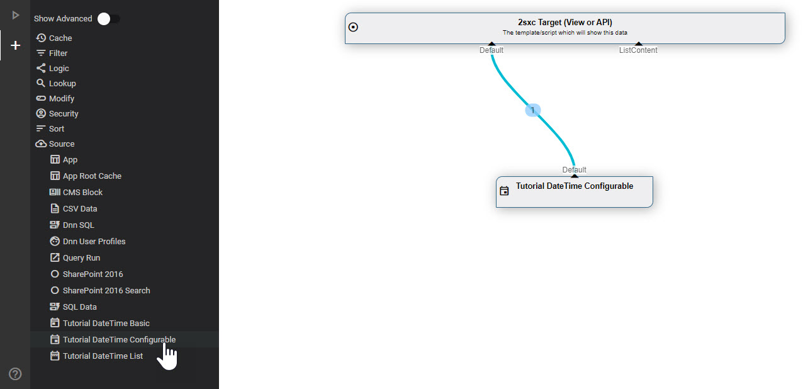
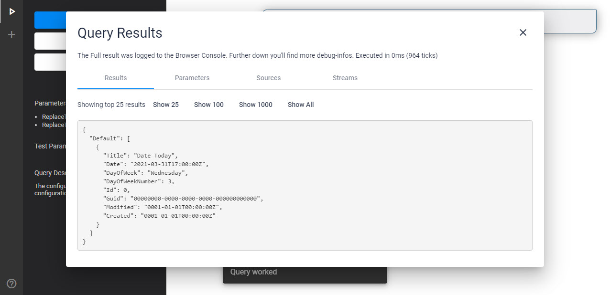
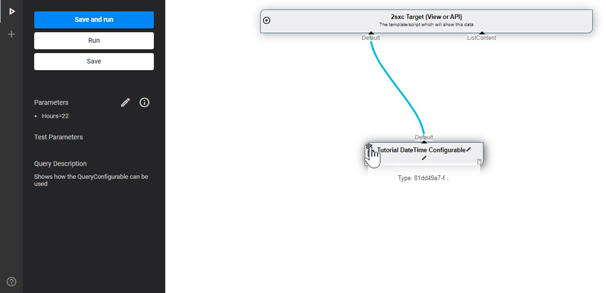
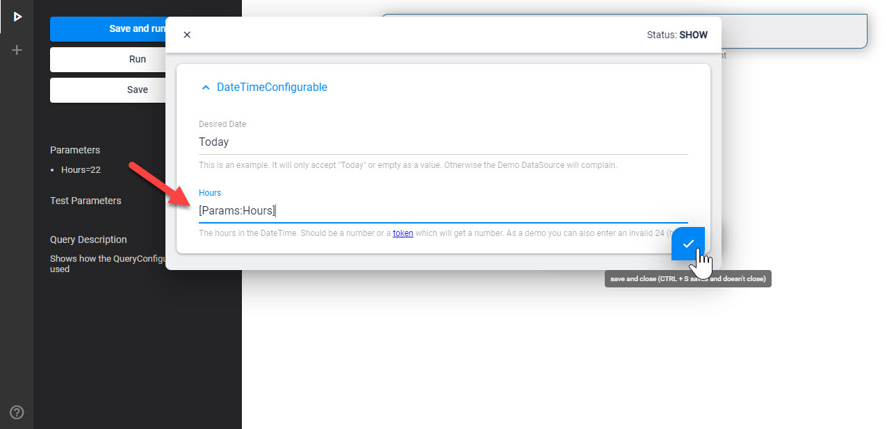
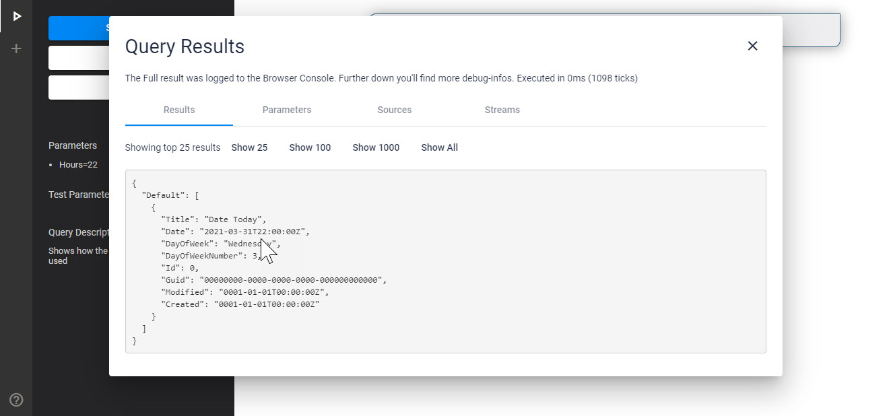
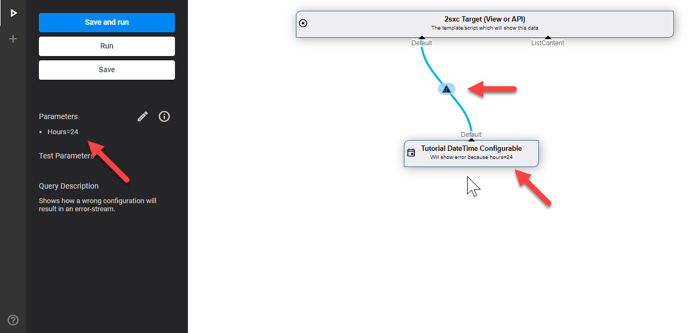
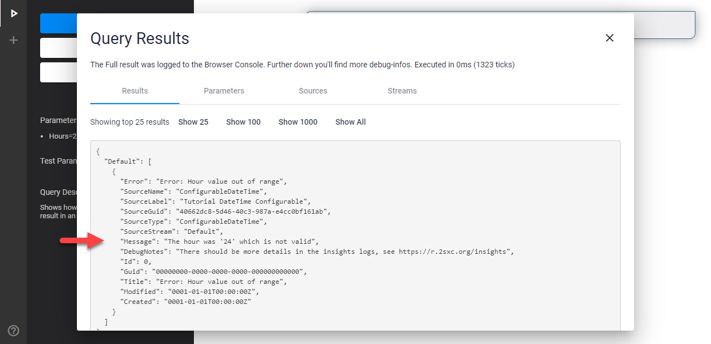

[!include[](_obsolete-docs.md)]

# Tutorial Custom DataSources - Configurable

This explains the **ConfigurableDateTime** DataSource in the [DataSource Tutorial](xref:NetCode.DataSources.Custom.TutorialBasic.Index).

This has a lot more features, like

1. Properties on the DataSource object to configure it
1. A Content-Type to let the admin configure it in the UI
1. Code to load the configured settings
1. Error handling code to provide good information if something is wrong

## Add to VisualQuery

This is what it looks like in [VisualQuery](xref:Basics.Query.VisualQuery.Index):



And this is what you see when you run it without configuration:



## Running with Configuration from Params

Since this DataSource has configuration enabled, the UI knows that it can offer a _Settings_ button:



You could just write a number like `14` but here we're showing how to use [Query Parameters](xref:Basics.Query.Parameters.Index).



The Result would then look like this:



## Running with Invalid Configuration

Here's an example with an invalid configuration where the Hour would be `24` (hours can only go from 0 to 23):



And here the resulting message which is optimized because the DataSource expected this mis-configuration:




## Source of the `ConfigurableDateTime` DataSource

This is the code for the simplest DataSource:


```c#
using System;
using System.Collections.Generic;
using System.Collections.Immutable;
using ToSic.Eav.Data;
using ToSic.Eav.DataSources;
using ToSic.Eav.DataSources.Queries;


// Demo / Training Code to help you create our own DataSource
// You can find the newest version here: https://github.com/2sic/datasource-tutorial-basic
// there is also an App showing you how it would be used
// and how such a data-source is configured. 

namespace ToSic.Tutorial.DataSource.Basic
{
  // Note that this attribute is necessary for the DataSource to show up in the 
  [VisualQuery(
    NameId = "81dd49a7-fa70-4e98-b73d-8299bb3231f0",
    Icon = "event",
    Type = DataSourceType.Source,
    NiceName = "DateTime Configurable",
    // Guid of the Content-Type which must be exported with this DataSource
    // It's located in .data/contenttypes
    // The class RegisterGlobalContentTypes ensures that 2sxc/EAV will find it
    ConfigurationType = "677210a2-cf08-46e5-a6b2-86e56e27be99",
    HelpLink = "https://go.2sxc.org/DsCustom")]
  public class ConfigurableDateTime : ExternalData
  {
    #region Configuration-properties
    private const string DesiredDateKey = "DesiredDate";
    private const string HoursKey = "Hours";

    /// <summary>
    /// A piece of demo-configuration. It must always be stored/accessed from the Configuration dictionary
    /// because everything in the config-dictionary will be token-resolved
    /// </summary>
    public string DesiredDate
    {
      get => Configuration[DesiredDateKey];
      set => Configuration[DesiredDateKey] = value;
    }

    /// <summary>
    /// A number-demo config. Note that we do error-checking and store it with SetError
    /// </summary>
    public int Hours
    {
      get
      {
        if (decimal.TryParse(Configuration[HoursKey], out var hour))
        {
          // check that it's a valid hour-range
          if (hour >= 0 && hour <= 23) return (int)hour;

          // If not, set the error, so that the code can later pick up the error-stream
          SetError("Hour value out of range", $"The hour was '{hour}' which is not valid");
          return 0;
        }

        // Apparently not a decimal, so set the error, so that the code can later pick up the error-stream
        SetError("Hour value invalid", $"Tried to parse the hour, but couldn't. Value was '{Configuration[HoursKey]}'");
        return 0;
      }
      set => Configuration[HoursKey] = value.ToString();
    }

    #endregion

    /// <summary>
    /// Constructs a new EntityIdFilter
    /// </summary>
    public ConfigurableDateTime()
    {
      // The out-list contains all out-streams.
      // For performance reasons we want to make sure that they are NOT created unless accessed
      // Because of this, we create a data-stream with a deferred call to GetEntities - like this:
      Provide(GetEntities);

      // Example of pre-configuring a text
      // This will place the token to be resolved into the variable
      // The tokens will be resolved before use
      // The following token means: 
      // - Try to use the configured value from the setting on this data-source in the VisualQuery
      // - if there is none, just use the value "Today"
      ConfigMask(DesiredDateKey, "[Settings:DesiredDate||Today]");

      // Example of pre-configuring a number value
      // We can't just say AnotherDemoConfig = "text" because that would not compile since it expects a number
      // So we just add the token to be resolved directly to the configuration list
      ConfigMask(HoursKey, "[Settings:Hours||17]");
    }


    /// <summary>
    /// This is the deferred call to retrieve entities
    /// If you created the source correctly it won't be called unless accessed
    /// This is recommended for performance reasons
    /// We also recommend placing the result in the cache...
    /// </summary>
    /// <returns></returns>
    private IImmutableList<IEntity> GetEntities()
    {
      // This will resolve the tokens before starting
      Configuration.Parse();

      // Here's your real code. 
      // Typically you will either perform some work with the In-streams
      // or retrieve data from another source like XML, RSS, SQL, File-storage etc.
      // Usually you would also need configuration from the UI - but sometimes not, especially if it's just for a very specific purpose
      #region Your Custom Business Logic

      try
      {
        // Check if we're trying to inform about today
        if (DesiredDate != "Today")
          return SetError("Demo Config not Today", "The Demo Configuration should be 'Today' or empty.");

        // Get the hours - and if something is wrong, the ErrorStream will be pre-filled
        var hours = Hours;
        if (!ErrorStream.IsDefaultOrEmpty)
          return ErrorStream;

        // For this demo we'll treat the current time as UTC
        var todayDate = DateTime.SpecifyKind(DateTime.Today, DateTimeKind.Utc);

        // In this demo we'll just create 1 entity containing some values related to today
        var today = new Dictionary<string, object>
        {
          {"Title", "Date Today"},
          {"Date", todayDate.AddHours(hours)},
          {"DayOfWeek", DateTime.Today.DayOfWeek.ToString()},
          {"DayOfWeekNumber", DateTime.Today.DayOfWeek}
        };

        // ...now convert to an entity with the data prepared before
        var ent = DataBuilder.Entity(today, titleField: "Title");
        return new List<IEntity> { ent }.ToImmutableArray();
      }
      catch (Exception ex)
      {
        // if something happens, let's return this information as a result
        return SetError("Unexpected Error", "The Configurable DateTime DataSource ran into an exception.", ex);
      }
      #endregion

    }
  }
}
```

This does a LOT more. Here the important bits

1. The [VisualQuery](xref:Basics.Query.VisualQuery.Index) Attribute has a lot more information
1. It has various properties like `Hour` which will be populated by settings in the Constructor...
1. ...and they have features to [detect errors and report them nicely](xref:NetCode.DataSources.Custom.Errors)
1. The `GetEntities()` safely checks if the Required `In` stream really exists - otherwise returns a clean [error stream](xref:NetCode.DataSources.Custom.Errors)
1. The configuration is then used in the data returned


---

## Read More

* Discover the [Basic DataSourceTutorial](xref:NetCode.DataSources.Custom.TutorialBasic.Index) with more examples

## History

1. Created 2017 for 2sxc 7
1. Completely rebuilt for 2sxc 11.13 and [VisualQuery](xref:Basics.Query.VisualQuery.Index) 3

