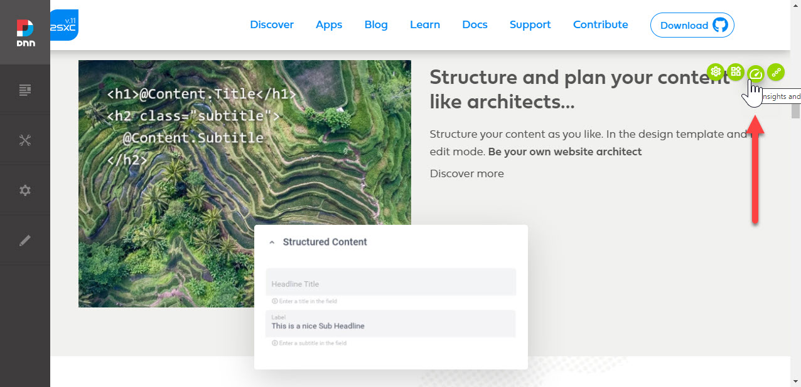
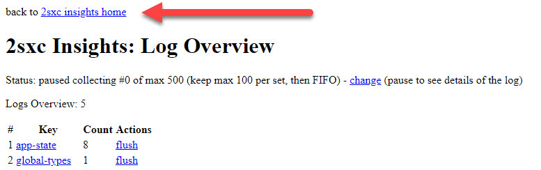
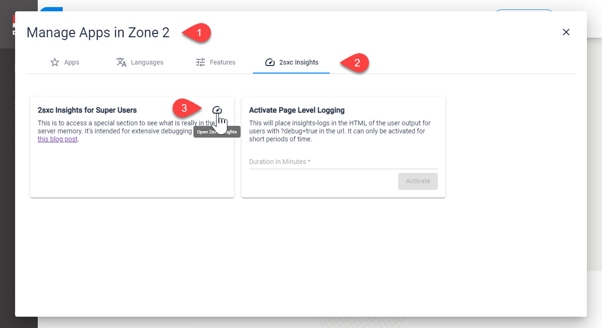
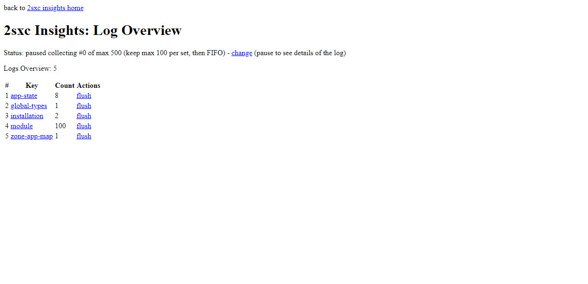
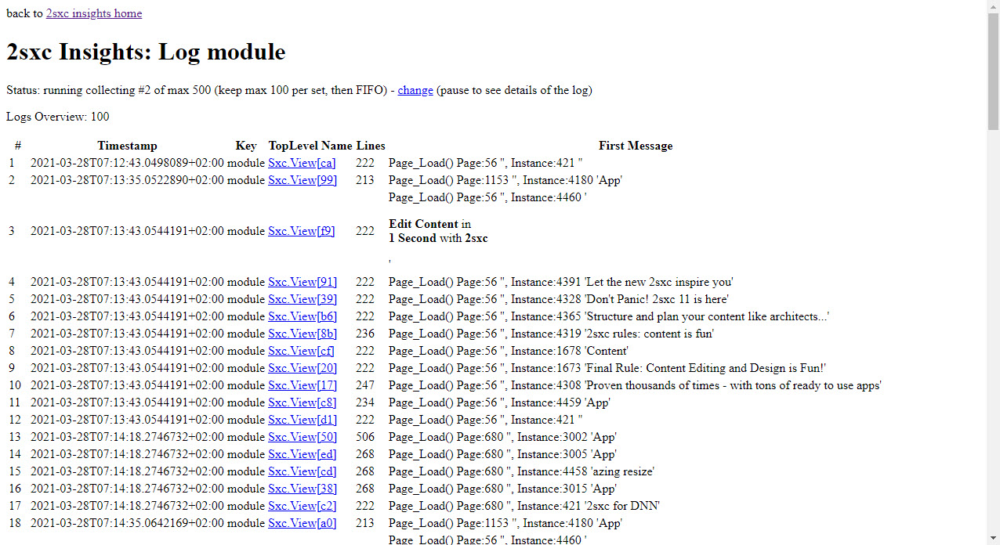
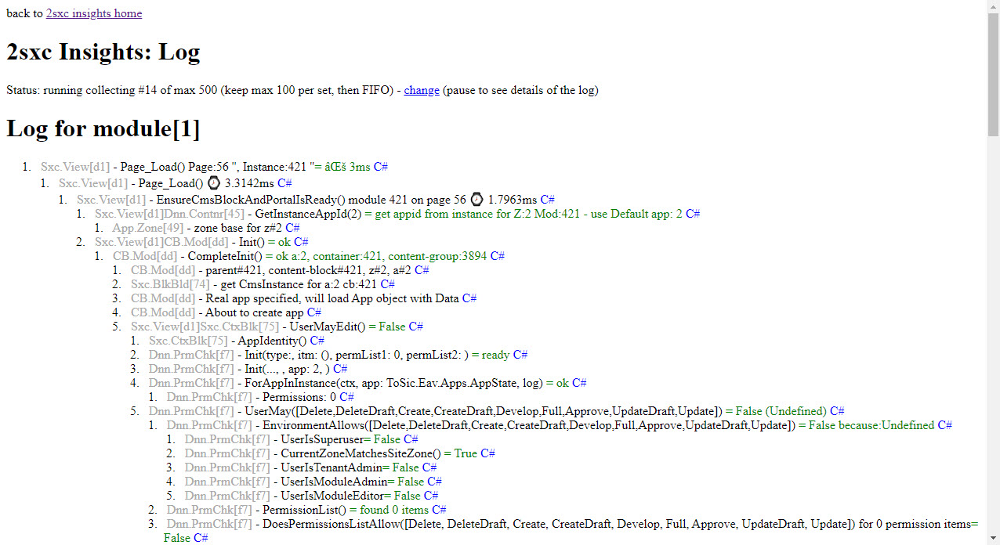

# 2sxc Insights on the Server

The Server **Insights** gives you a lot of internal information such as

1. Logs of the latest modules being rendered or WebAPI calls
1. Global Content-Types which are loaded
1. Cache states
1. Internal memory with all the data

...and way more. 

## Open Server Insights

The quick way to open them, which goes directly to the _Logs_ is with the dashboard icon on the toolbar (only available for super users):

From here you can also click on this to get to the insights home.

The other way to open it is using the Apps Administration and opening the Insights from there. 

## 2sxc Insights Logs

The logs show you what happens on each request. You typically need it to figure out things like

* How long did the entire work take
* How long did a specific step in the code need
* What values were passed around - especially when running into errors
* Errors and exceptions which we don't show to the user but want to see as a debugger

It looks like this:

From here you can see all kinds of logs what is happening on the server. Here's a list showing the some Module-Render logs:

...and here a view of the Details, showing that it took 3ms to render this block:

---

## Read also

1. 

## History

1. Introduced 2sxc Insights (server-side) v9.31
1. [Major enhancements](https://2sxc.org/en/blog/post/awesome-insights-in-10-22) in v10.22
